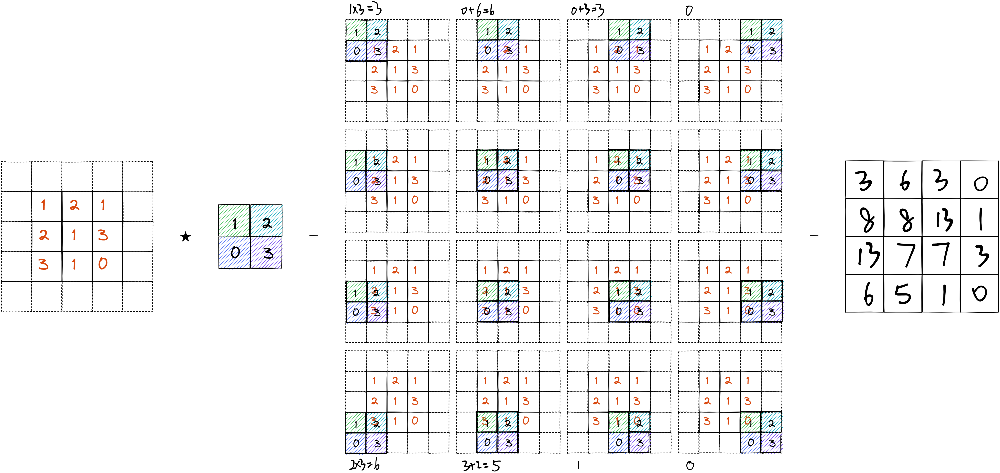
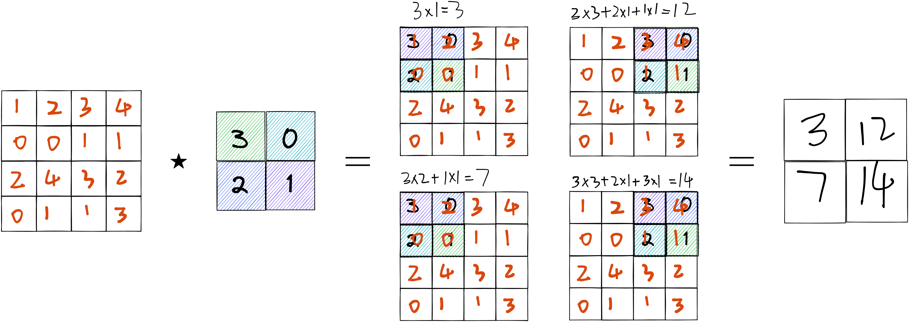
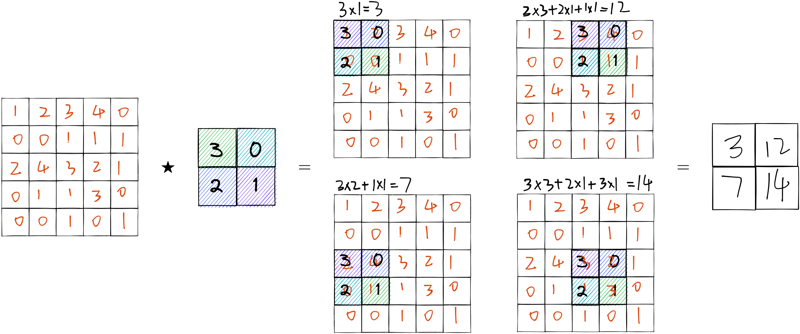
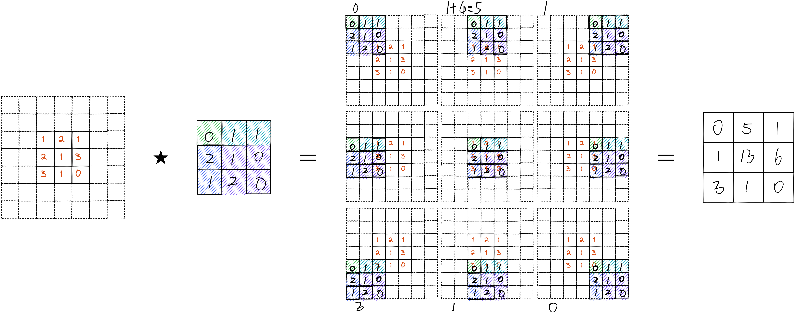
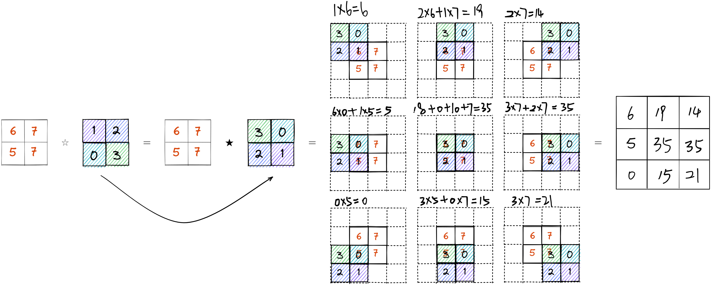
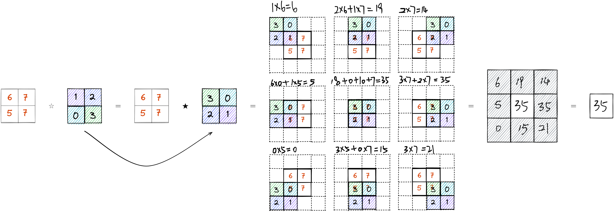

# Convolution Arithmetic Tutorial

> 主讲人：胡冠宇  日期：2021-11-22

## 1. Convolution Arithmetic

Direct Convolution: $Y=K \bigstar X$

- Dimension of Kernel $K$: $k$
- Input $X$ Size: $i$
- Output Size: $o$
- Border Padding: $p$
- Stride: $s$

### 1.1. No Zero Padding, Unit Strides

#### 1.1.1. Stride=1, Padding=0

##### 1.1.1.1. 代数形式

- $i=3, \ k=2, \ p=0, \ s=1$

**总结**：

1. output 尺寸实际上就是指 Kernel 能走几步

$$
\begin{align*}
o &= i - k + 1 \\
\Rightarrow o &= 3-2 + 1 \\
&= 2
\end{align*}
$$


---

##### 1.1.1.2. 示例


**手写卷积代码：**

```python
X_conv = torch.tensor(
    [[1.0, 2.0, 1.0],
     [2.0, 1.0, 3.0],
     [3.0, 1.0, 0.0]]
)
K = torch.tensor(
    [[1.0, 2.0],
     [0.0, 3.0]]
)

```

```python
def conv(X, K):
    h, w = K.shape
    Y = torch.zeros((X.shape[0] - h + 1, X.shape[1] - h + 1))
    for i in range(Y.shape[0]):
        for j in range(Y.shape[1]):
            Y[i, j] = (X[i:i + h, j:j + w] * K).sum()
    return Y

Y_conv = conv(X_conv, K)
print('--------手写 Normal Convolution: padding = 0, stride = 1--------\n', Y_conv)
```

**PyTorch 代码：**

```python
X_conv = torch.reshape(X_conv, (1, 1, 3, 3))  
K = torch.reshape(K, (1, 1, 2, 2))
```

```text
in_channels (int): Number of channels in the input image  
out_channels (int): Number of channels produced by the convolution  
kernel_size (int or tuple): Size of the convolving kernel  
stride (int or tuple, optional): Stride of the convolution. Default: 1  
padding (int, tuple or str, optional): Padding added to all four sides of the input. Default: 0  
padding_mode (string, optional): ``'zeros'``, ``'reflect'``, ``'replicate'`` or ``'circular'``. Default: ``'zeros'``  
dilation (int or tuple, optional): Spacing between kernel elements. Default: 1  
groups (int, optional): Number of blocked connections from input channels to output channels. Default: 1  
bias (bool, optional): If ``True``, adds a learnable bias to the output. Default: ``True``
```

```python
torch_conv_p0_s1 = torch.nn.Conv2d(1, 1, kernel_size=2, stride=1, padding=0, dilation=1, bias=False)  
torch_conv_p0_s1.weight.data = K  
Y_torch_conv_p0_s1 = torch_conv_p0_s1(X_conv)  
print('--------1.1.2  torch  Normal Convolution: padding = 0, stride = 1--------\n', Y_torch_conv_p0_s1)
```

---

### 1.2. Zero Padding, Unit Strides

#### 1.2.1. Stride=1, Padding=1

- $i=3, \ k=2, \ p=1, \ s=1$

$$
\begin{align*}
o &= i + 2p - k + 1 \\
\Rightarrow o &= 3 + 2 \times 1-2 + 1 \\
&= 4
\end{align*}
$$

**总结**：

1. output 尺寸实际上就是指 Kernel 能走几步
2. padding 就是给输入矩阵上下左右各加上一圈$0$



```python
torch_conv_p1_s1 = torch.nn.Conv2d(1, 1, kernel_size=2, stride=1, padding=1, dilation=1, bias=False)  
torch_conv_p1_s1.weight.data = K  
Y_torch_conv_p1_s1 = torch_conv_p1_s1(X_conv)  
print('--------1.2.1 Zero Padding, Unit Strides: padding = 1, stride = 1--------\n', Y_torch_conv_p1_s1)
```

---

#### 1.2.2. Same Padding

Normal Convolution 在什么情况下输入尺寸和输出尺寸相同，即 $i=o$ ?

- $i=o, \ k, \ p, \ s=1$

$$
\begin{align*}
o &=  i + 2p - k + 1 \\
\Rightarrow i & = i + 2p - k + 1 \\
2p &=  k - 1  \\
p &= \frac{k - 1}{2}, \ (k=2n+1)
\end{align*}
$$

**总结**：

1. output 尺寸实际上就是指 Kernel 能走几步
2. padding 就是给输入矩阵上下左右各加上一圈$0$
3. 若要使 Normal Convolution 实现 output 和 input 尺寸相同，则 $p = \frac{k - 1}{2}$ 且$k$必须是**奇数**，否则无法实现

##### 1.2.2.1. E.g. 1

- $i=3, \ k=3, \ p=\frac{k-1}{2}=\frac{3-1}{2}=1, \ s=1$

$$
\begin{align*}
o &= i + 2p - k + 1 \\
\Rightarrow o &= 3 + 2 \times 1-3 + 1 \\
&= 3 \\
&= i
\end{align*}
$$


```python
K_same = torch.tensor(
    [[0.0, 1.0, 1.0],
     [2.0, 1.0, 0.0],
     [1.0, 2.0, 0.0]]
)
K_same = torch.reshape(K_same, (1, 1, 3, 3))
torch_conv_p1_s1 = torch.nn.Conv2d(1, 1, kernel_size=3, stride=1, padding=1, dilation=1, bias=False)
torch_conv_p1_s1.weight.data = K_same
Y_torch_conv_same = torch_conv_p1_s1(X_conv)
print('--------1.2.2  Same Padding: stride = 1--------\n', Y_torch_conv_same)

```

---

### 1.3. No Zero Padding, Non-unit Strides

#### 1.3.1. Stride=2, Padding=0

##### 1.3.1.1. E.g. 1

- $i=4, \ k=2, \ p=0, \ s=2$

$$
\begin{align*}
o &= \frac { i + 2p - k }{s} + 1 \\
\Rightarrow o &= \frac {4 + 2 \times0-2}{2} + 1 \\
&= 2
\end{align*}
$$

**总结**：

1. output 尺寸实际上就是指 Kernel 能走几步
2. padding 就是给输入矩阵上下左右各加上一圈$0$
3. 若要使 Normal Convolution 实现 output 和 input 尺寸相同，则 $p = \frac{k - 1}{2}$ 且$k$必须是**奇数**，否则无法实现
4. 如果 Normal Convolution 时有 Stride，我们可以通过计算 kernel 能走几步（$\frac { i + 2p - k }{s}$）从而判断 output 的尺寸



```python
X_conv_s2_p0 = torch.tensor(
    [[1.0, 2.0, 3.0, 4.0],
     [0.0, 0.0, 1.0, 1.0],
     [2.0, 4.0, 3.0, 2.0],
     [0.0, 1.0, 1.0, 3.0]]
)
K_s2_p0 = torch.tensor(
    [[3.0, 0.0],
     [2.0, 1.0]]
)

X_conv_s2_p0 = torch.reshape(X_conv_s2_p0, (1, 1, 4, 4))
K_s2_p0 = torch.reshape(K_s2_p0, (1, 1, 2, 2))
torch_conv_p1_s1 = torch.nn.Conv2d(1, 1, kernel_size=2, stride=2, padding=0, dilation=1, bias=False)
torch_conv_p1_s1.weight.data = K_s2_p0
Y_torch_conv_same = torch_conv_p1_s1(X_conv_s2_p0)
print('--------1.3.1.1 No Zero Padding, Non-unit Strides Stride=2, Padding=0 Eg1--------\n', Y_torch_conv_same)
```

---

##### 1.3.1.2. E.g. 2

- $i=5, \ k=2, \ p=0, \ s=2$

$$
\begin{align*}
o &= \lfloor\frac { i + 2p - k }{s}\rfloor + 1 \\
\Rightarrow o &= \lfloor\frac { 5 + 2 \times0-2 }{2}\rfloor + 1 \\
&= 2
\end{align*}
$$

**总结**：

1. output 尺寸实际上就是指 Kernel 能走几步
2. padding 就是给输入矩阵上下左右各加上一圈$0$
3. 若要使 Normal Convolution 实现 output 和 input 尺寸相同，则 $p = \frac{k - 1}{2}$ 且$k$必须是**奇数**，否则无法实现
4. 如果 Normal Convolution 时有 Stride，我们可以通过计算 kernel 能走几步（$\lfloor \frac {i + 2p - k }{s}\rfloor$）从而判断 output 的尺寸，考虑到 $i + 2p - k$ 不一定可以整除 $s$，这种情况下需要对步数向下取整，因为走不动就不走了



```python
X_conv_s2_p0 = torch.tensor(
    [[1.0, 2.0, 3.0, 4.0, 0.0],
     [0.0, 0.0, 1.0, 1.0, 1.0],
     [2.0, 4.0, 3.0, 2.0, 1.0],
     [0.0, 1.0, 1.0, 3.0, 0.0],
     [0.0, 0.0, 1.0, 0.0, 1.0]]
)
K_s2_p0 = torch.tensor(
    [[3.0, 0.0],
     [2.0, 1.0]]
)

X_conv_s2_p0 = torch.reshape(X_conv_s2_p0, (1, 1, 5, 5))
K_s2_p0 = torch.reshape(K_s2_p0, (1, 1, 2, 2))
torch_conv_p1_s1 = torch.nn.Conv2d(1, 1, kernel_size=2, stride=2, padding=0, dilation=1, bias=False)
torch_conv_p1_s1.weight.data = K_s2_p0
Y_torch_conv_same = torch_conv_p1_s1(X_conv_s2_p0)
print('--------1.3.1.2 No Zero Padding, Non-unit Strides Stride=2, Padding=0  Eg2--------\n', Y_torch_conv_same)
```

---

### 1.4. Zero Padding, Non-unit Strides

#### 1.4.1. Stride=2, Padding=2

- $i=3, \ k=3, \ p=2, \ s=2$

$$
\begin{align*}
o &= \lfloor \frac { i + 2p - k }{s} \rfloor + 1 \\
\Rightarrow o &= \lfloor \frac { 3 + 2 \times 2-3 }{2} \rfloor + 1 \\
&= 3
\end{align*}
$$



```python
K_same_s2_p2 = torch.tensor(
    [[0.0, 1.0, 1.0],
     [2.0, 1.0, 0.0],
     [1.0, 2.0, 0.0]]
)
K_same_s2_p2 = torch.reshape(K_same_s2_p2, (1, 1, 3, 3))
torch_conv_p1_s1 = torch.nn.Conv2d(1, 1, kernel_size=2, stride=2, padding=2, dilation=1, bias=False)
torch_conv_p1_s1.weight.data = K_same_s2_p2
Y_torch_conv_same = torch_conv_p1_s1(X_conv)
print('--------1.4.1 Zero Padding, Non-unit Strides Stride=2, Padding=2--------\n', Y_torch_conv_same)
```

---

## 2. Transposed Convolution Arithmetic

Transposed Convolution: $Y=K ☆ X$

转置卷积（Transposed Convolution）也叫 Fractionally Strided Convolution，但千万不要叫成反卷积，这在很多论文中被错误表述。
随着转置卷积在神经网络可视化上的成功应用，其被越来越多的工作所采纳比如：场景分割、生成模型等。

**转置卷积可以等价为正向卷积，正向卷积是 size 从大到小，转置卷积是 size 从小到大，为了实现从小到大，要给小的 input 加上 padding**

### 2.1. 为什么叫做转置卷积？

#### 2.1.1. Normal Convolution

Normal Convolution: $Y=K \bigstar X$


$$
\begin{align*}
X&=\left[\begin{array}{cccc}
x_{0,0}, \ x_{0,1}, \ x_{0,2} \\
x_{1,0}, \ x_{1,1}, \ x_{1,2} \\
x_{2,0}, \ x_{2,1}, \ x_{2,2} \\
\end{array}\right]
\Rightarrow
\left[\begin{array}{cccc}
x_{0,0} \\
x_{0,1} \\
x_{0,2} \\
x_{1,0} \\
x_{1,1} \\
x_{1,2} \\
x_{2,0} \\
x_{2,1} \\
x_{2,2} \\
\end{array}\right], \ K=\left[\begin{array}{cccc}
w_{0,0}, \ w_{0,1}  \\
w_{1,0}, \ w_{1,1}  \\
\end{array}\right]
\Rightarrow
\left[\begin{array}{cccc}
w_{0,0} & w_{0,1} &  0 & w_{1,0} & w_{1,1} & 0 & 0 & 0 & 0  \\
0 & w_{0,0} & w_{0,1} & 0 & w_{1,0} & w_{1,1} & 0 & 0 & 0  \\
0 & 0 & 0 & w_{0,0} & w_{0,1} & 0 & w_{1,0} & w_{1,1} & 0  \\
0 & 0 & 0 & 0 & w_{0,0} & w_{0,1} & 0 & w_{1,0} & w_{1,1}
\end{array}\right]
\\
Y&=K \bigstar X
=\left[\begin{array}{cccc}
w_{0,0} & w_{0,1} &  0 & w_{1,0} & w_{1,1} & 0 & 0 & 0 & 0  \\
0 & w_{0,0} & w_{0,1} & 0 & w_{1,0} & w_{1,1} & 0 & 0 & 0  \\
0 & 0 & 0 & w_{0,0} & w_{0,1} & 0 & w_{1,0} & w_{1,1} & 0  \\
0 & 0 & 0 & 0 & w_{0,0} & w_{0,1} & 0 & w_{1,0} & w_{1,1}
\end{array}\right]
\cdot
\left[\begin{array}{cccc}
x_{0,0} \\
x_{0,1} \\
x_{0,2} \\
x_{1,0} \\
x_{1,1} \\
x_{1,2} \\
x_{2,0} \\
x_{2,1} \\
x_{2,2} \\
\end{array}\right] \\
&=
\left[\begin{array}{cccc}
w_{0,0} \cdot x_{0,0} + w_{0,1} \cdot x_{0,1} +  0 \cdot x_{0,2} + w_{1,0} \cdot x_{1,0} + w_{1,1} \cdot x_{1,1} + 0 \cdot x_{1,2} + 0 \cdot x_{2,0} + 0 \cdot x_{2,1} + 0 \cdot x_{2,2}  \\
0 \cdot x_{0,0} + w_{0,0} \cdot x_{0,1} + w_{0,1} \cdot x_{0,2} + 0 \cdot x_{1,0} + w_{1,0} \cdot x_{1,1} + w_{1,1} \cdot x_{1,2} + 0 \cdot x_{2,0} + 0 \cdot x_{2,1} + 0 \cdot x_{2,2}  \\
0 \cdot x_{0,0} + 0 \cdot x_{0,1} + 0 \cdot x_{0,2} + w_{0,0} \cdot x_{1,0} + w_{0,1} \cdot x_{1,1} + 0 \cdot x_{1,2} + w_{1,0} \cdot x_{2,0} + w_{1,1} \cdot x_{2,1} + 0 \cdot x_{2,2}  \\
0 \cdot x_{0,0} + 0 \cdot x_{0,1} + 0 \cdot x_{0,2} + 0 \cdot x_{1,0} + w_{0,0} \cdot x_{1,1} + w_{0,1} \cdot x_{1,2} + 0 \cdot x_{2,0} + w_{1,0} \cdot x_{2,1} + w_{1,1} \cdot x_{2,2}
\end{array}\right] =
\left[\begin{array}{cccc}
o_{0,0} \\
o_{0,1} \\
o_{1,0} \\
o_{1,1} \\
\end{array}\right]
\Rightarrow
\left[\begin{array}{cccc}
o_{0,0} & o_{0,1} \\
o_{1,0} & o_{1,1}
\end{array}\right]

\end{align*}
$$

#### 2.1.2. Transposed Convolution

Transposed Convolution: $Y'=K^T ☆ X'$


$$
\begin{align*}
X' &= \left[\begin{array}{cccc}
x'_{0,0}, \
x'_{0,1} \\
x'_{1,0}, \
x'_{1,1} \\
\end{array}\right]
\Rightarrow
\left[\begin{array}{cccc}
x'_{0,0} \\
x'_{0,1} \\
x'_{1,0} \\
x'_{1,1} \\
\end{array}\right], \
K^T = \left[\begin{array}{cccc}
w_{0,0} & 0 & 0 & 0 \\
w_{0,1} & w_{0,0} & 0 & 0 \\
0 & w_{0,1} & 0 & 0 \\
w_{1,0} & 0 & w_{0,0} & 0 \\
w_{1,1} & w_{1,0} & w_{0,1} & w_{0,0} \\
0 & w_{1,1} & 0 & w_{0,1} \\
0 & 0 & w_{1,0} & 0 \\
0 & 0 & w_{1,1} & w_{1,0} \\
0 & 0 & 0 & w_{1,1} \\
\end{array}\right]
\\
Y'&=K^T ☆ X' =
\left[\begin{array}{cccc}
w_{0,0} & 0 & 0 & 0 \\
w_{0,1} & w_{0,0} & 0 & 0 \\
0 & w_{0,1} & 0 & 0 \\
w_{1,0} & 0 & w_{0,0} & 0 \\
w_{1,1} & w_{1,0} & w_{0,1} & w_{0,0} \\
0 & w_{1,1} & 0 & w_{0,1} \\
0 & 0 & w_{1,0} & 0 \\
0 & 0 & w_{1,1} & w_{1,0} \\
0 & 0 & 0 & w_{1,1} \\
\end{array}\right]
\cdot
\left[\begin{array}{cccc}
x'_{0,0} \\
x'_{0,1} \\
x'_{1,0} \\
x'_{1,1} \\
\end{array}\right]
=
\left[\begin{array}{cccc}
w_{0,0} \cdot x'_{0,0} + 0 \cdot x'_{0,1} + 0 \cdot x'_{1,0} + 0 \cdot x'_{1,1} \\
w_{0,1} \cdot x'_{0,0} + w_{0,0} \cdot x'_{0,1} + 0 \cdot x'_{1,0} + 0 \cdot x'_{1,1} \\
0 \cdot x'_{0,0} + w_{0,1} \cdot x'_{0,1} + 0 \cdot x'_{1,0} + 0 \cdot x'_{1,1} \\
w_{1,0} \cdot x'_{0,0} + 0 \cdot x'_{0,1} + w_{0,0} \cdot x'_{1,0} + 0 \cdot x'_{1,1} \\
w_{1,1} \cdot x'_{0,0} + w_{1,0} \cdot x'_{0,1} + w_{0,1} \cdot x'_{1,0} + w_{0,0} \cdot x'_{1,1} \\
0 \cdot x'_{0,0}  ++ w_{1,1} \cdot x'_{0,1} + 0 \cdot x'_{1,0} + w_{0,1} \cdot x'_{1,1} \\
0 \cdot x'_{0,0} + 0 \cdot x'_{0,1} + w_{1,0} \cdot x'_{1,0} + 0 \cdot x'_{1,1} \\
0 \cdot x'_{0,0} + 0 \cdot x'_{0,1} + w_{1,1} \cdot x'_{1,0} + w_{1,0} \cdot x'_{1,1} \\
0 \cdot x'_{0,0} + 0 \cdot x'_{0,1} + 0 \cdot x'_{1,0} + w_{1,1} \cdot x'_{1,1} \\
\end{array}\right]
=
\left[\begin{array}{cccc}
Y'_{0,0} \\
Y'_{0,1} \\
Y'_{0,2} \\
Y'_{1,0} \\
Y'_{1,1} \\
Y'_{1,2} \\
Y'_{2,0} \\
Y'_{2,1} \\
Y'_{2,2} \\
\end{array}\right]
\Rightarrow
\left[\begin{array}{cccc}
Y'_{0,0} & Y'_{0,1} & Y'_{0,2}  \\
Y'_{1,0} & Y'_{1,1} & Y'_{1,2}  \\
Y'_{2,0} & Y'_{2,1} & Y'_{2,2}  \\
\end{array}\right]
\end{align*}
$$

**总结**：

- Normal Convolution: $Y=K \bigstar X$--->$K(4,9) \cdot X(9,1)=Y(4,1)$
- Transposed Convolution: $Y'=K^T ☆ X'$--->$K^T(9,4) \cdot X'(4,1)=Y(9,1)$
- $X$ 和 $Y'$ 尺寸相同都是 $(9,1)$, $Y$ 和 $X'$ 尺寸相同都是 $(4,1)$, 对 Kernel 做了转置，但是要注意，此处只是形状相同，数值不同，**因此只能称为转置卷积，而不能称为反卷积**！！！

#### 2.1.3. Notations:

- Dimension of $K$
	- Transposed Dimension of $K$: $k$
	- Equivalent Direct Dimension of $K'$: $k'$
- Input $X$ Size
	- Transposed Input $X$ Size: $i$
	- Equivalent Direct Input $X'$ Size: $i'$
- Output $Y$ Size
	- Transposed Output $Y$ Size: $o$
	- Equivalent Direct Output $Y'$ Size: $o'$
- Border Padding $P$
	- Transposed Border Padding: $p$
	- Equivalent Direct Border Padding: $p'$
- Stride $S$
	- Transposed Stride: $s$
	- Equivalent Direct Stride: $s'$

### 2.2. No Zero Padding, Unit Strides, Transposed

#### 2.2.1. Stride=1, Padding=0

##### 2.2.1.1. Arithmetic


---

###### 2.2.1.1.1. E.g. 1

此处可证明把 Normal Convolution 的 output 和 kernel 拿来作 Transposed Convolution 的 Input 和 Kernel， Transposed Convolution 的 output 和 Normal Convolution 的 Input 值不同，但 size 相同。


---

###### 2.2.1.1.2. E.g. 2


```python
X_trans = torch.tensor(
    [[6.0, 7.0],
     [5.0, 7.0]]
)
K = torch.tensor(
    [[1.0, 2.0],
     [0.0, 3.0]]
)
```

```python
def trans_conv(X, K):
    h, w = K.shape
    Y = torch.zeros((X.shape[0] + h - 1, X.shape[1] + w - 1))
    for i in range(X.shape[0]):
        for j in range(X.shape[1]):
            Y[i:i + h, j:j + w] += X[i, j] * K
    return Y

Y_trans = trans_conv(X_trans, K)
print('--------2.2.1.1 No Zero Padding, Unit Strides, Transposed: Stride=1, Padding=0 手写转置卷积 --------\n', Y_trans)
```

---

##### 2.2.1.2. Transposed Convolution Equivalent to Direct Convolution

- Transposed: $i=2, \ k=2, \ p=0, \ s=1$
- Direct: $i'=i=2, \ k'=k=2, \ p'=k'-1=1, \ s'=s=1$

$$
\begin{align*}
o = o' &= i' + 2p' - k' + 1 \\
& = i'+ 2(k'-1) -(k'-1) \\
& = i' + (k'-1) \\
\Rightarrow o & = 2 + (2-1) \\
& = 3
\end{align*}
$$

**总结**：

1. Transposed Convolution 等价于对 Input 做 Padding 为 $k-1$ 的 Direct Convolution
2. 做等价 Direct Convolution 时要对 Kernel 做**水平垂直**翻转


---



```python
print(X_trans.shape)  
print(K.shape)  
X_trans = torch.reshape(X_trans, (1, 1, 2, 2))  
K = torch.reshape(K, (1, 1, 2, 2))  
print(X_trans.shape)  
print(K.shape)
```

```python
in_channels (int): Number of channels in the input image  
out_channels (int): Number of channels produced by the convolution  
kernel_size (int or tuple): Size of the convolving kernel  
stride (int or tuple, optional): Stride of the convolution. Default: 1  
padding (int or tuple, optional): ``dilation * (kernel_size - 1) - padding`` zero-padding will be added to both sides of each dimension in the input. Default: 0
output_padding (int or tuple, optional): Additional size added to one side of each dimension in the output shape. Default: 0
groups (int, optional): Number of blocked connections from input channels to output channels. Default: 1  
bias (bool, optional): If ``True``, adds a learnable bias to the output. Default: ``True``  
dilation (int or tuple, optional): Spacing between kernel elements. Default: 1
```

```python
torch_trans_conv = nn.ConvTranspose2d(1, 1, kernel_size=2, stride=1, padding=0, output_padding=0, dilation=1, bias=False)  
torch_trans_conv.weight.data = K  
Y_torch_trans_s1_p0 = torch_trans_conv(X_trans)  
print('--------2.2.1.2 No Zero Padding, Unit Strides, Transposed: Stride=1, Padding=0--------\n', Y_torch_trans_s1_p0)
```

---

### 2.3. Zero Padding, Unit Strides, Transposed

#### 2.3.1. Stride=1, Padding=1

##### 2.3.1.1. Arithmetic


---

##### 2.3.1.2. Transposed Convolution Quivalent to Direct Convolution

- Transposed: $i=2, \ k=2, \ p=1, \ s=1$
- Direct: $i'=i=2, \ k'=k=2, \ p'=k'-1=2-1=1, \ s'=s=1$

$$
\begin{align*}
o = o' &= i' + 2p' - k' + 1-2p \\
& = i'+ 2(k' - 1) -(k'-1) - 2p \\
& = i' + (k' - 1) - 2p \\
\Rightarrow o & = 2 + (2-1) - 2 \times 1 \\
& = 1
\end{align*}
$$

**总结**：

1. Transposed Convolution 等价于对 Input 做 Padding 为 $k-1$ 的 Direct Convolution
2. 做等价 Direct Convolution 时要对 Kernel 做**水平垂直**翻转
3. Transposed Convolution 的 Padding 等价于对 output 做 Padding, 所以要在最后减去 $2p$



```python
torch_trans_conv_s1_p1 = nn.ConvTranspose2d(1, 1, kernel_size=2, stride=1, padding=1, output_padding=0, dilation=1, bias=False)
torch_trans_conv_s1_p1.weight.data = K
Y_torch_trans_s1_p1 = torch_trans_conv_s1_p1(X_trans)
print('--------2.3.1 Zero Padding, Unit Strides, Transposed: Stride=1, Padding=1--------\n', Y_torch_trans_s1_p1)
```

---

#### 2.3.2. Stride=1, Padding=2

##### 2.3.2.1. Transposed Convolution Quivalent to Direct Convolution

- Transposed: $i=5, \ k=4, \ p=2, \ s=1$
- Direct: $i'=i=5, \ k'=k=4, \ p'=k'-1=4-1=3, \ s'=s=1$

$$
\begin{align*}
o = o' &= i' + 2p' - k' + 1-2p \\
& = i'+ 2(k' - 1) -(k'-1) - 2p \\
& = i' + (k' - 1) - 2p \\
\Rightarrow o & = 5 + (4-1) - 2 \times 2 \\
& = 4
\end{align*}
$$


```python
X_trans_s1_p2 = torch.tensor(
    [[1.0, 0.0, 2.0, 1.0, 1.0],
     [2.0, 1.0, 0.0, 1.0, 3.0],
     [3.0, 0.0, 0.0, 0.0, 1.0],
     [1.0, 0.0, 3.0, 0.0, 2.0],
     [2.0, 2.0, 1.0, 1.0, 1.0]]
)
K_s1_p2 = torch.tensor(
    [[1.0, 2.0, 3.0, 4.0],
     [5.0, 4.0, 3.0, 2.0],
     [0.0, 1.0, 2.0, 3.0],
     [1.0, 1.0, 3.0, 0.0]]
)
X_trans_s1_p2 = torch.reshape(X_trans_s1_p2, (1, 1, 5, 5))
K_s1_p2 = torch.reshape(K_s1_p2, (1, 1, 4, 4))
torch_trans_conv_s1_p2 = nn.ConvTranspose2d(1, 1, kernel_size=4, stride=1, padding=2, output_padding=0, dilation=1, bias=False)
torch_trans_conv_s1_p2.weight.data = K_s1_p2
Y_torch_trans_s1_p2 = torch_trans_conv_s1_p2(X_trans_s1_p2)
print('--------2.3.2 Zero Padding, Unit Strides, Transposed: Stride=1, Padding=2--------\n', Y_torch_trans_s1_p2)
```

---

#### 2.3.3. Same Padding

Transposed Convolution 在什么情况下 $i=o$ ?

- Transposed: $i=o, \ k, \ p, \ s=1$
- Direct: $i'=i=o=o', \ k'=k, \ p'=k'-1, \ s'=s=1$

$$
\begin{align*}
o = o' &=  i' + (k' - 1) - 2p \\
\Rightarrow i' & = i' + (k' - 1) - 2p \\
2p &=  k' - 1  \\
p &= \frac{k' - 1}{2}, \ (k'=2n+1)
\end{align*}
$$

**总结**：

1. Transposed Convolution 等价于对 Input 做 Padding 为 $k-1$ 的 Direct Convolution
2. 做等价 Direct Convolution 时要对 Kernel 做**水平垂直**翻转
3. Transposed Convolution 的 Padding 等价于对 output 做 Padding, 所以要在最后减去 $2p$
4. 在 $p=\frac{k - 1}{2}, \ (k=2n+1)$  时 (kernel 是**奇数** $p$ 是 kernel 尺寸 $k-1$ 的一半时) input 和 output 大小一样


```python
X_trans_Same = torch.tensor(
    [[1.0, 2.0, 3.0],
     [0.0, 4.0, 1.0],
     [2.0, 1.0, 0.0]]
)
K_Same = torch.tensor(
    [[0.0, 1.0, 1.0],
     [2.0, 1.0, 0.0],
     [1.0, 2.0, 0.0]]
)
X_trans_Same = torch.reshape(X_trans_Same, (1, 1, 3, 3))
K_Same = torch.reshape(K_Same, (1, 1, 3, 3))
torch_trans_Same = nn.ConvTranspose2d(1, 1, kernel_size=3, stride=1, padding=1, output_padding=0, dilation=1, bias=False)
torch_trans_Same.weight.data = K_Same
Y_torch_trans_Same = torch_trans_Same(X_trans_Same)
print('--------2.3.3 Zero Padding, Unit Strides, Transposed: Same Padding--------\n', Y_torch_trans_Same)
```

---

### 2.4. No Zero Padding, Non-unit Strides, Transposed

#### 2.4.1. Stride=2, Padding=0

##### 2.4.1.1. E.g. 1

###### 2.4.1.1.1. Transposed Convolution Quivalent to Direct Convolution

- Transposed: $i=2, \ k=2, \ p=0, \ s=2$
- Direct: $i'=i=2, \ k'=k=2, \ p'=k'-1=2-1=1, \ s'=1$

$$
\begin{align*}
o = o' &= i' + 2p' + (s - 1) \cdot (i'-1) - k' + 1-2p \\
& = i'+ 2(k' - 1) + (s - 1) \cdot (i'-1) - (k'-1) - 2p \\
& = i' + (k' - 1) + (s - 1) \cdot (i'-1) - 2p \\
& = (i' - 1) + (s - 1) \cdot (i'-1) + k'  - 2p \\
& = s(i'-1) + k'  - 2p \\
\Rightarrow o & = 2(2-1) + 2-2 \times 0 \\
& = 4
\end{align*}
$$

**总结**：

1. Transposed Convolution 等价于对 Input 做 Padding 为 $k-1$ 的 Direct Convolution
2. 做等价 Direct Convolution 时要对 Kernel 做**水平垂直**翻转
3. Transposed Convolution 的 Padding 等价于对 output 做 Padding, 所以要在最后减去 $2p$
4. 在 $p=\frac{k - 1}{2}, \ (k=2n+1)$  时 (kernel 是偶数 p 是 kernel 尺寸的一半时) input 和 output 大小一样
5. 无论 Transposed Convolution 的 Stride 为几，等价的 Driect Convolution 都要做 Stride=1 的操作
6. 在元素的每行和每列之间（共 $i-1$ 个位置）插入 $s-1$ 行和列的 $0$ （如果 $s=0$ 则插入 0 行/列，也就是不加）。


```python
torch_trans_conv_s2_p0 = nn.ConvTranspose2d(1, 1, kernel_size=2, stride=2, padding=0, output_padding=0, dilation=1, bias=False)
torch_trans_conv_s2_p0.weight.data = K
Y_torch_trans_s2_p0 = torch_trans_conv_s2_p0(X_trans)
print('--------2.4.1.1 No Zero Padding, Non-unit Strides, Transposed: Stride=2, Padding=0--------\n', Y_torch_trans_s2_p0)
```

---

##### 2.4.1.2. E.g. 2

###### 2.4.1.2.1. Transposed Convolution Quivalent to Direct Convolution

- Transposed: $i=3, \ k=2, \ p=0, \ s=2$
- Direct: $i'=i=3, \ k'=k=2, \ p'=k'-1=2-1=1, \ s'=1$

$$
\begin{align*}
o = o' &= s(i'-1) + k'  - 2p \\
\Rightarrow o & = 2(3-1) + 2-2 \times 0 \\
& = 6
\end{align*}
$$


```python
X_trans_s2_p0 = torch.tensor(
    [[1.0, 2.0, 3.0],
     [0.0, 4.0, 1.0],
     [2.0, 1.0, 0.0]]
)
K_s2_p0 = torch.tensor(
    [[1.0, 2.0],
     [0.0, 3.0]]
)
X_trans_s2_p0 = torch.reshape(X_trans_s2_p0, (1, 1, 3, 3))
K_s2_p0 = torch.reshape(K_s2_p0, (1, 1, 2, 2))
torch_trans_conv_s2_p0 = nn.ConvTranspose2d(1, 1, kernel_size=2, stride=2, padding=0, output_padding=0, dilation=1, bias=False)
torch_trans_conv_s2_p0.weight.data = K_s2_p0
Y_torch_trans_s2_p0 = torch_trans_conv_s2_p0(X_trans_s2_p0)
print('--------2.4.1.2 No Zero Padding, Non-unit Strides, Transposed: Stride=2, Padding=0, E.g. 2--------\n', Y_torch_trans_s2_p0)
```

---

### 2.5. Zero Padding, Non-unit Strides, Transposed

#### 2.5.1. Stride=2, Padding=1

##### 2.5.1.1. Transposed Convolution Quivalent to Direct Convolution

- Transposed: $i=2, \ k=2, \ p=1, \ s=2$
- Direct: $i'=i=2, \ k'=k=2, \ p'=k'-1=2-1=1, \ s'=1$

$$
\begin{align*}
o = o' &= s(i'-1) + k'  - 2p \\
\Rightarrow o & = 2(2-1) + 2-2 \times 1 \\
& = 2
\end{align*}
$$


```python
torch_trans_conv_s2_p1 = nn.ConvTranspose2d(1, 1, kernel_size=2, stride=2, padding=1, output_padding=0, dilation=1, bias=False)
torch_trans_conv_s2_p1.weight.data = K
Y_torch_trans_s2_p1 = torch_trans_conv_s2_p1(X_trans)
print('--------2.5.1 Zero Padding, Non-unit Strides, Transposed: Stride=2, Padding=1--------\n', Y_torch_trans_s2_p1)
```

---

### 2.6. Output Padding

#### 2.6.1. output_padding = 1, Stride = 2, Padding = 0

在 Normal Convocation 中

- $  s=2 $ 时，Input $i= 4 \ or \  5$, output 都为 $2$，则可推导出我们做 Transposed Convolution 时，也可能会有这种情况发生，那么我们需要使用 output padding 来实现，我们定义 $a$ 为 output padding 的值。
	- 首先 $a < s$, 因为如果大于 $s$  则 output 需要 $+1$
	- 另外，$a$ 的值应该是 $i+2p-k$  mod $s$, 整除则说明正好可以走 $s$ 步，而余数说明还余了 $a$ 步，走不动了

在 Transposed Convocation 中，为了实现这种需求我们只能在 output 计算以后补上 $a$ 行和 $a$ 列，一般我们补在右边和底边

- Transposed: $i=2, \ k=2, \ p=0, \ s=2, \ a=1$
- Direct: $i'=i=2, \ k'=k=2, \ p'=k'-1=2-1=1, \ s'=1$

$$
\begin{align*}
o = o' &=  s(i'-1) + k'  - 2p + a\\
\Rightarrow o & = 2(2-1) + 2-2 \times 0 + 1\\
& = 5
\end{align*}
$$

**总结**：

1. Transposed Convolution 等价于对 Input 做 Padding 为 $k-1$ 的 Direct Convolution
2. 做等价 Direct Convolution 时要对 Kernel 做**水平垂直**翻转
3. Transposed Convolution 的 Padding 等价于对 output 做 Padding, 所以要在最后减去 $2p$
4. 在 $p=\frac{k - 1}{2}, \ (k=2n+1)$  时 (kernel 是偶数 p 是 kernel 尺寸的一半时) input 和 output 大小一样
5. 无论 Transposed Convolution 的 Stride 为几，等价的 Driect Convolution 都要做 Stride=1 的操作
6. 在元素的每行和每列之间（共 $i-1$ 个位置）插入 $s-1$ 行和列的 $0$ （如果 $s=0$ 则插入 0 行/列，也就是不加）。
7. 在 Transposed Convocation 中，stride $s \neq 1$ 时可以有不同尺寸的 output，为了实现这种需求我们只能在 output 计算以后补上 $a$ 行和 $a$ 列 $(0<a<s)$，一般我们补在右边和底边


```python
torch_trans_conv_s2_op1 = nn.ConvTranspose2d(1, 1, kernel_size=2, stride=2, padding=0, output_padding=1, dilation=1, bias=False)
torch_trans_conv_s2_op1.weight.data = K
Y_torch_trans_s2_op1 = torch_trans_conv_s2_op1(X_trans)
print('-------- padding = 0, stride = 2, output_padding=1--------\n', Y_torch_trans_s2_op1)
```

---

## 3. References

- [A guide to convolution arithmetic for deep learning](https://arxiv.org/abs/1603.07285)
- [Convolution arithmetic tutorial — Theano 1.1.2+29.g8b2825658.dirty documentation](https://theano-pymc.readthedocs.io/en/latest/tutorial/conv_arithmetic.html#transposed-convolution-arithmetic)
- [GitHub - vdumoulin/conv_arithmetic: A technical report on convolution arithmetic in the context of deep learning](https://github.com/vdumoulin/conv_arithmetic)
