# Audio Signal Processing

主讲人：胡冠宇 

时间：2022-01-06


# Basic of Sound


## 1. Periodic and Aperiodic Sound

周期性和非周期性声音


## 2. Waveform - 波形图

包含以下信息：

- Frequency - 频率
- Intensity - 强度
- Timbre - 音色；音质；音品

### 2.1. Sin Wave


**公式**

$$
y(t)=ASin(2\pi ft + \varphi)
$$

- $A$: amplitude - **振幅**, how high or low this perturbation(扰动) in air pressure goes, 振幅越大，声音越响
- $f$: frequency - **频率**, 单位 Hz(**cycle per second-每秒多少个循环**), connected with the **period** $T$, $f=\frac{1}{T}$，频率越大，音高越高
- $t$: time - **时间**
- $\varphi$: phase - **相位**, what is the position of the wave form at time zero

## 3. Frequency - 频率 (objective)

### 3.1. Hearing Range

单位是 Hz，一秒完成多少个周期
用频率衡量听到的声音


## 4. Pitch - 音高 (subjective)

- pitch is the concepts that we use for the perception of frequency - 主观感知 frequency 的变量
- we don't hear frequency in a linear way but rather in a **logarithmic way** - 我们听到的频率是对数的形式，而不是线性的
- 2 frequencies are **perceived similarly** if they differ by a power of 2

### 4.1. Midi Notes


- **C4**: **字母 C** 表示音高， **数字 1** 表示 octave (信频、音阶, 音程)
- A4 和 A5 听起来一样，但是 A5 要高一些，pitch-frequency 图如下

### 4.2. Pitch-frequency Chart

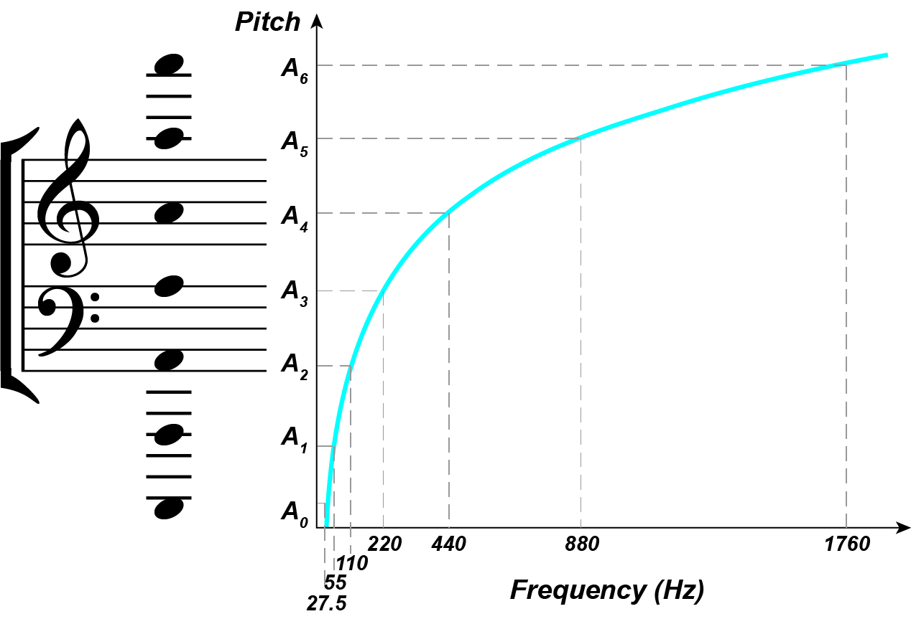

### 4.3. Mapping Pitch to Frequency

**octave** is divided 12 semitones (半音)

$$
F(p)=2^{\frac{p-69}{12}} \cdot 440
$$

根据公式即可计算 Pitch 所对应的频率，其中 $p$ 值得是 Midi 中的 Pitch number

例如：

$$
F(60)=2^{\frac{60-69}{12}} \cdot 440 = 261.6 Hz
$$

**The ratio between two subsequent semitones (半音):**

$$
F(p+1) / F(p) = 2^{\frac{1}{12}} = 1.059
$$

### 4.4. Cent - 音分

**音分**（英语：cent）是一个用于**度量 octave**的对数标度单位。在十二平均律中，将一个八度音程分为 12 个半音。每一个半音的音程（相当于相邻钢琴键间的音程）等于 100 音分。音分通常用于度量极小的音程，或是用于对比不同调律系统中可比音程的大小差异。然而事实上，若是两个相邻音符间的音程只有相差 1 音分时，由于差距极为微小，人耳很难辨别。

- Octave divided in 1200 cents
- 100 cents in a semitone
- Noticeable pitch difference: 10-25 cents

## 6. Sound Intensity - 声强 (objective)

声音功率用, 单位时间内通过垂直于声波传播方向的单位面积的能量(声波的能量流密度)表示．声强的单位是瓦/平方米．声强的大小与声速、声波的频率的平方、振幅的平方成正比．超声波的声强大是因为其频率很高，炸弹爆炸的声强大是因为振幅大．

- Sound power per unit area
- Measured in $W/m^2$

### 6.1. Sound Power - 声能

- Rate at which energy is transferred
- Energy per unit of time emitted by a sound source in all directions
- Measured in watt ($W$)

### 6.2. Threshold of Hearing

Human can perceive sounds with very small intensities - 人可以感知到的最小的声强

$$
TOH=10^{-12}W/m^2
$$

### 6.3. Threshold of Pain

感觉到痛的阈值

$$
TOP = 10 W/m^2
$$

### 6.4. Intensity Level (Sound Pressure Level) - 声强级

- **Logarithmic** scale
- Measured in decibels (/ˈdesɪˌbel/ 分贝) ($dB$)
- Ratio between two intensity values
- Use an intensity of reference ($TOH$)

$$
dB(I) = 10 \cdot log_{10}(\frac{I}{I_{TOH}})
$$

当声强级为 0 时，即表示人可以感知到的最小的声强

$$
dB(I_{TOH})=10 \cdot log_{10}(\frac{I_{TOH}}{I_{TOH}})
$$

- Every ~3 dBs, intensity doubles - 每升高三分贝，强度就会增加一倍

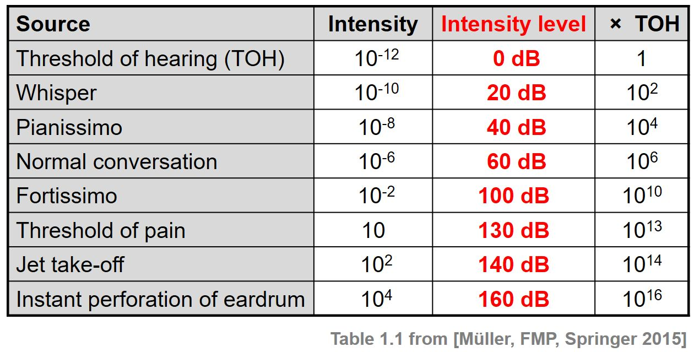

## 5. Loudness - 响度 (subjective)

**响度**（英文：loudness），又称**音量**，是量度声音大小的知觉量，符号为 $N$，常用单位为$phon(宋)$。与声强不同，响度是受主观知觉影响的物理量。在同等声强下，不同频率的声音会造成不同的听觉感知，因此量度响度时，须对不同频率的声音作出修正。响度的大小与声强密切相关，但响度随声强的变化不是简单的线性关系，而是接近于对数关系。当声音的频率、声波的波形改变时，人对响度大小的感觉也将发生变化。

响度描述的是声音的响亮程度，表示人耳对声音的主观感受，其计量单位是宋，定义 $1kHz$，声压级为 $40dB$ 纯音的响度为 $1 宋$。

- Subjective perception of sound intensity - 主观感受声音的响度
- Depends on duration / frequency of a sound
- Measured in $phons$(宋)

### 5.1. Equal Loudness Contours - 等响曲线

等响曲线的横坐标为**频率**，纵坐标为**dB**。在同一条曲线之上，所有频率和声压的组合，都有着一样的响度。最下方的曲线表示人类能听到的最小的声音响度，即听阈(TOH)。等响曲线反映了响度听觉的许多特点：

- 声压级愈高，响度一般也愈高。
- 响度与频率有关，相同声压级的纯音，频率不同，响度也不同。
- 对于不同频率的纯音，提高声压级带来的响度增长，也有所不同。


## 7. Timbre - 音色

- Colour of sound
- Diff between two sounds with same intensity, frequency, duration
- Described with words like: bright, dark, dull, harsh, warm

### 7.1. What Are the Features of Timbre?

- Timbre is multidimensional
- Sound envelope - 声音包络
- Harmonic content
- Amplitude / frequency modulation

### 7.2. Sound Envelope - 声音包络

In sound and music, an envelope describes how a sound changes over time. It may relate to elements such as amplitude (volume), frequencies (with the use of filters) or pitch. For example, a piano key, when struck and held, creates a near-immediate initial sound which gradually decreases in volume to zero.

在声音和音乐中，描述了声音如何随时间变化。 它可能与振幅（音量）、频率（使用滤波器）或音高等元素有关。 例如，当敲击并按住钢琴键时，会产生近乎立即的初始声音，音量逐渐减小到零。

**Attack-Decay-Sustain-Release Model (攻击-衰减-维持-释放模型)**

**Attack:** The amplitude of this sounds has an initial spike and that's like the attack e.g. strike a key on a piano like spike a amplitude

**Decay:** sound decay

**Sustain:** sound stabilizes a sustained period, remains like constant in amplitude

**Release:** fading out phase of a sound

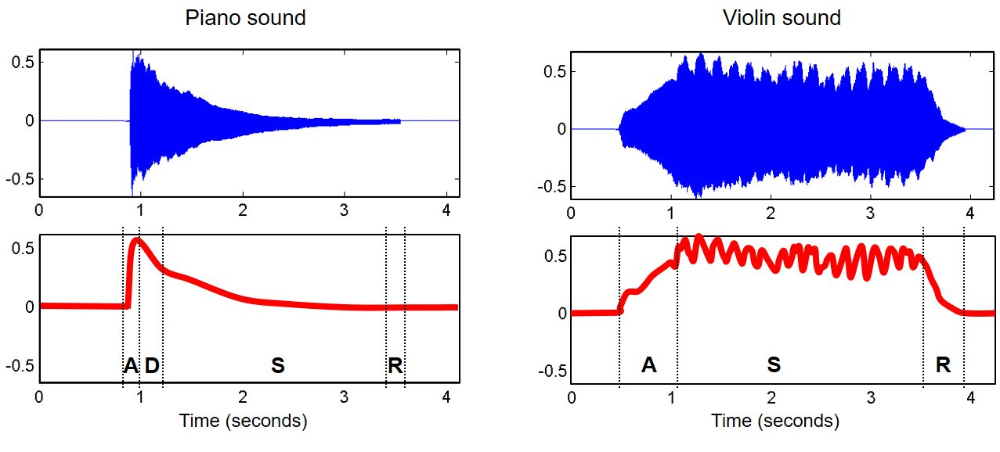

### 7.3. Complex Sound - 复合音

一个声音的基础频率被称作它的基音或**基频 (fundamental frequency)**，而除了简单正弦波之外，大部分的声音都包含基频与其他不同的频率组成。

这些 Non Fundamental frequency 如果是基频的**整数倍**，则被称为**泛音或谐波 (harmonics)**；如果是非正整数倍，例如 2.5 倍，则被称为**分音 (partials)**；而若为基频的几分之几，则称为 subharmonic。

- **基音 (fundamental frequency)** 被视为**第一泛音** (first harmonic)，通常比其他 harmonics 大声。
- 在第一谐波两倍频率的音色被称为**第二泛音 (second harmonic)**，以此类推。
- 钟、木琴块和许多其他打击乐器都能产生泛音不相关的分音。
- 每种从基频产生的不同谐波，都会产生不同声音**质感 (timbral quality)**。

大体来说，整数倍或能被整数（如八度音程、奇数或偶数泛音）除尽的泛音听起来都更具 “音乐感”。不是整数倍或不能被整数除尽的音调称为不和谐陪音或分音音调。当大量这类不和谐陪音组合在一起时，听起来就会显得 “嘈杂”。

- Superposition of sinusoids-正弦曲线的叠加
- A **partial (分音)** is a sinusoid used to describe a sound-分音是用于描述声音的正弦曲线
- The lowest partial is called **fundamental frequency (基频)**-最低的基音称为基频
- A **harmonic partial (泛音)** is a frequency that’s a multiple of the fundamental frequency- harmonic 是基频的整数倍数
- **Inharmonicity (偏差音)** indicates a deviation from a harmonic partial-偏差音表示偏离 harmonic 的声音
- orchestra instruments (管弦乐 e.g. 小提琴) tend to be like harmonic whereas like percussive instruments (打击乐，e.g. 架子鼓) tend to have a lot of inharmonicity

**基音 (fundamental frequency)：**

$$
f_1 = 440Hz
$$

**泛音 (harmonic partial):**

$$
f_2 = 2 \cdot 440=880Hz,f_3=3 \cdot 440=1320Hz, \dots
$$

**代码**


```python
import os
import librosa
import librosa.display
import matplotlib.pyplot as plt
import numpy as np

def plot_spectrogram(signal, name):
    """Compute power spectrogram with Short-Time Fourier Transform and plot result."""
    spectrogram = librosa.amplitude_to_db(librosa.stft(signal))
    plt.figure(figsize=(20, 15))
    librosa.display.specshow(spectrogram, y_axis="log")
    plt.colorbar(format="%+2.0f dB")
    plt.title(f"Log-frequency power spectrogram for {name}")
    plt.xlabel("Time")
    plt.show()

BASE_FOLDER = r"./resources"
violin_sound_file = "violin_c.wav"
piano_sound_file = "piano_c.wav"
tremolo_sound_file = "tremolo.wav"

# load sounds
violin_c4, _ = librosa.load(os.path.join(BASE_FOLDER, violin_sound_file))
piano_c5, _ = librosa.load(os.path.join(BASE_FOLDER, piano_sound_file))

plot_spectrogram(violin_c4, "c4 on violin")
plot_spectrogram(piano_c5, "c5 on piano")
```

**violin:**

x 轴时时间，y 轴是 logarithmic scale 的频率，每个点都有颜色，表示了 intensity level

观察发现在频率 256 一带 (这个频率代表 C4) 的 energy 较多，在 521 附近能够观察到泛音 (harmonic partial)，是基频的 2 倍，在 3 倍频率也能够看到，以此类推…


**piano:**

这个基频在 C5， it's an octave above the violin sound, 观察频谱图发现基本和上图是同样的规律，但是和小提琴不同，钢琴频率越高其泛音 partial 能量越少。

为什么不同的声音听起来不一样？因为 the distribution of the energy across the different partials being different


### 7.4. Frequency Modulation - 调频 FM

- Frequency modulation - 频率调制，调频 FM
- Amplitude Modulation - 幅度调制，调幅 AM

- AKA vibrato - 调频在音乐中被称作**颤音** (vibrato), 颤音是音符在**音调**上快速重复的轻微变化。歌手和音乐家使用颤音使音乐听起来更感性。
- Periodic variation in frequency - 频率的周期性变化
- In music, used for expressive purposes


The idea behind this is that a message signal(紫色) you want to use to modulate the frequency of carrier signal(绿色)，apply message signal on carrier signal, 即可得到红色的 signal

### 7.5. Amplitude Modulation - 调幅 AM

- AKA _tremolo_ - 震音，如果某人唱歌或说话的声音中带有颤音，它会上下移动，而不是停留在同一个音符上。
- Periodic variation in amplitude
- In music, used for expressive purposes

基本同上原理，应用消息信号到载波信号，即可得到调幅的信号，resoruces 文件夹里面有示例音乐

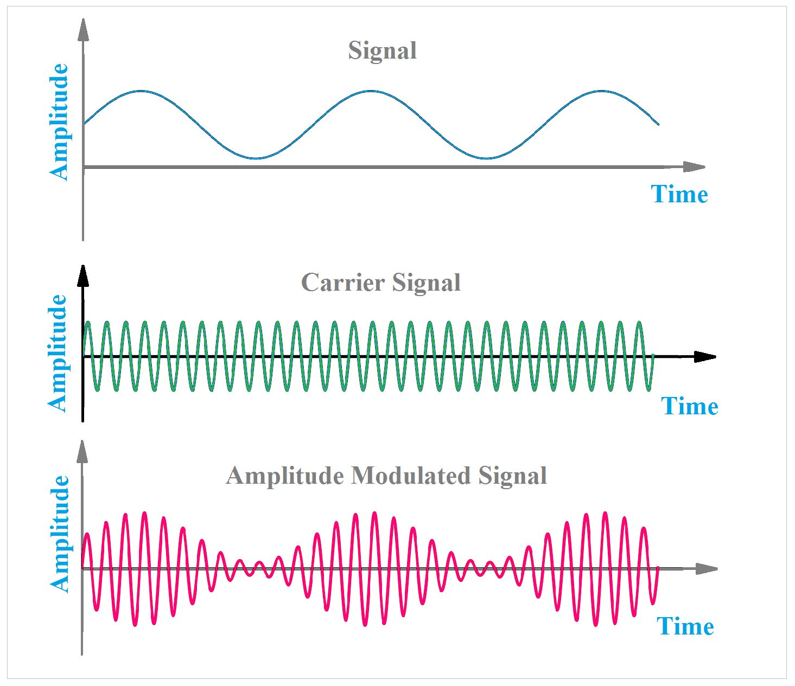


# Audio Signal

## 1. Analog Signal - 模拟信号

模拟信号（英语：analog signal）是指在时域上数学形式为**连续函数**的信号。与模拟信号对应的是数字信号，后者采取分立的逻辑值，而前者可以获取连续值。**理论上，模拟信号的分辨率趋近无穷大。**

- Continuous values for time
- Continuous values for amplitude

## 2. Digital Signal

- Sequence of discrete values
- Data points can only take on a finite number of values

## 3. Analog to Digital Conversion (ADC)

- Sampling
- Quantization

### 3.1. Sampling

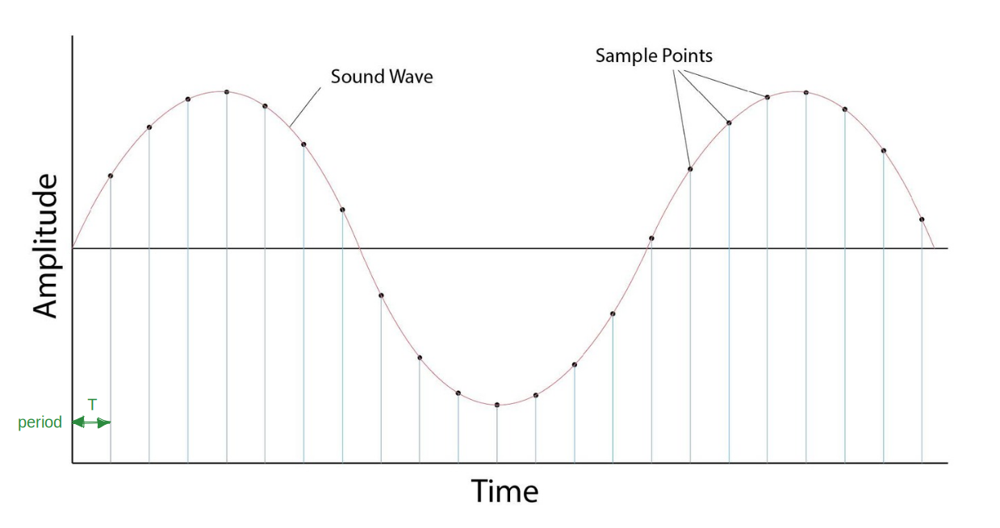

### 3.2. Locating Samples

$$
t_n=n\cdot T
$$

### 3.3. Sampling Rate - 采样率

采样率（也称为采样速度或者采样频率）定义了**每秒从连续信号中提取并组成离散信号的采样个数**，它用赫兹（$Hz$）来表示。采样频率的倒数叫作 **采样周期 ($T$)** 或采样时间，它是采样之间的时间间隔。注意不要将采样率与比特率（bit rate，亦称“比特率”）相混淆。

$$
s_r = \frac{1}{T}
$$

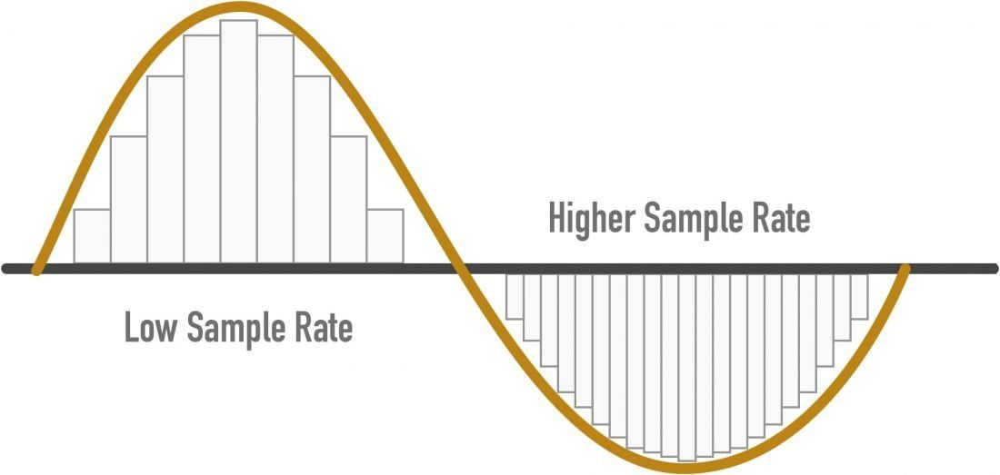

**Why sampling rate = 44100Hz?**

### 3.4. Nyquist Frequency - 奈奎斯特采样定理

根据**奈奎斯特理论**，只有**采样频率高于原始信号最高频率的两倍**时，才能把数字信号较为精准地还原成模拟信号。

$$
f_N=\frac{s_r}{2}
$$

如果不能满足这个条件，那么采样后的信号中高于采样率一半的频率的那部分信号就会受到限制，被重建成低于采样率一半的信号，和原本低频率部分的信号产生一种“**混叠**”的现象。这种现象会较大地影响听感，在实际的录混中一般都是要避免的。

人耳听觉的频率范围在 20Hz 到 20000Hz 之间。所以说，按照奈奎斯特理论，20000Hz 的两倍，即 40000Hz 以上的采样率对于人耳来说已经基本足够。

**Nyquist frequency for CD**

$$
f_N=\frac{44100}{2}=22050Hz
$$

### 3.5. Aliasing - 混淆

当采样频率设置不合理时，即采样频率低于 2 倍的信号频率时，会导致原本的高频信号被采样成低频信号。如下图所示，红色信号是原始的高频信号，但是由于采样频率不满足采样定理的要求，导致实际采样点如图中蓝色实心点所示，将这些蓝色实际采样点连成曲线，可以明显地看出这是一个低频信号。在图示的时间长度内，原始红色信号有 18 个周期，但采样后的蓝色信号只有 2 个周期。也就是采样后的信号频率成分为原始信号频率成分的 1/9，这就是所谓的混叠：高频混叠成低频了。

对连续信号进行等时间采样时，如果采样频率不满足采样定理，采样后的信号频率就会发生混叠，即高于奈奎斯特频率（采样频率的一半）的频率成分将被重构成低于奈奎斯特频率的信号。这种频谱的重叠导致的失真称为混叠，也就是高频信号被混叠成了低频信号。


### 3.6. Quantization - 量化 (信号处理)

量化在数字信号处理领域是指将信号的连续取值（或者大量可能的离散取值）近似为有限多个（或较少的）离散值的过程。量化主要应用于从连续信号到数字信号的转换中。连续信号经过采样成为离散信号，离散信号经过量化即成为数字信号。注意离散信号并不需要经过采样的过程。信号的采样和量化通常都是由 ADC 实现的。

例如 CD 音频信号就是按照 44100Hz 的频率采样，按 16 比特量化为有着 65536（=$2162^{{16}}$）个可能取值的数字信号。

量化就是将模拟声音的波形转换为数字，表示采样值的**二进制位数**决定了量化的精度。量化的过程是先将整个幅度划分成有限个小幅度（量化阶距）的集合，把落入某个阶距内的样值归为一类，并赋予相同的量化值。

- Resolution =Bit depth - 位深度= num. of bits
- CD resolution = 16 bits，$2^{16}=65536$

#### 3.6.1. Memory for 1min of Sound

- Sampling rate = 44100 Hz
- Bit depth = 16 bits
- 1Byte = 8bit

**每分钟：**

$$
\begin{align*}
16\ bit \times 44,100\ Hz \ \times 60s&=42,336,000 \ bit/s \\
&= 42,336,000/8=5,292,000 \ Byte/s\\
&=5,292,000/1024/1024 \ MB \\
&=5.05MB
\end{align*}
$$

### 3.7. Dynamic Range - 动态范围

系统可以记录的最大/最小信号之间的差异

resolution 大，dynamic range 就大

### 3.8. Signal-to-quantization-noise ratio (SQNR)

暂时把它理解为动态范围
$$
\begin{align*}
SQNR \approx6.02 \times Q \\
SQNR \approx 96dB
\end{align*}
$$
$Q:$bit depth

- Relationship between max signal strength and quantization error - 最大信号强度与量化误差的关系
- Correlates with dynamic range


---
date created: 2021-12-24,14:03:52
date latest modified: 2021-12-30,19:11:36
---

# Audio Features

## 1. Type of Audio Features

- Level of abstraction
- Temporal scope
- Music aspect
- Signal domain
- ML approach

### 1.1. Level of Abstraction

#### 1.1.1. High-Level

instrumentation, key, chords, melody, rhythm, tempo, lyrics, genre, mood

#### 1.1.2. Mid-Level

pitch-and beat-related descriptors, such as notes, fluctuation patterns, MFCCs

#### 1.1.3. Low-Level

amplitude envelope, energy, spectral centroid, spectral flux, zero-crossing rate

### 1.2. Temporal Scope

- Instantaneous (~50ms)
- Segment-level (seconds)
- Global

### 1.3. Music Aspect

- Beat
- Timbre
- Pitch
- Harmony
- …

### 1.4. Signal Domain

- Time domain: extracted from a waveforms
	- amplitude envelope
	- Root-mean square energy
	- Zero crossing rate

- Frequency domain - 应用傅里叶变换，将时域信号转成频域信号
	- Band energy ratio
	- Spectral centroid
	- Spectral flux

- Time-frequency representation
	- Spectrogram
	- Mel-spectrogram
	- Constant-Q transform

| Time Domain                                                  | Frequency Domain                                             | Time-Frequency                                               |
| ------------------------------------------------------------ | ------------------------------------------------------------ | ------------------------------------------------------------ |
| 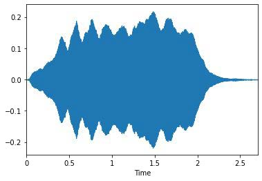 | 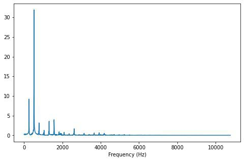 |  |

### 1.5. Types of Intelligent Audio Systems


## 2. Feature Extract

### 2.1. Time-domain Feature Pipeline


#### 2.1.1. Frames

- 人能感知到声音的持续时间是 10ms，一个 44.1KHz 的 sample (采样点) 的持续时间为 0.0227ms，

$$
Dueation \ 1 \ sample << Ear's \ time \ resolution \ (10ms)
$$

- frame 的 sample 数量 一般是 2 的倍数，应用 fast Fourier transform 的时候能提高计算效率
- Typical values: 256-8192

**duration of a frame**:

$$
d_f = \frac{1}{s_r} \cdot K
$$

$s_r:$ 采样率
$K:$ frame size，几个采样点

**常见:**

$$
d_f = \frac{1}{44,100Hz} \cdot 512=11.6ms
$$

### 2.2. Frequency Domain Feature Pipeline

**pipeline:**


**Frequency Domain:**

应用傅里叶变换，将时域信号转成频域信号

The Fourier transform converts the function's time-domain representation, shown in red, to the function's frequency-domain representation, shown in blue. The component frequencies, spread across the frequency spectrum, are represented as peaks in the frequency domain.
.gif)

frequency domain refers to the analysis of mathematical functions or signals with respect to frequency, rather than time. Put simply, a time-domain graph shows how a signal changes over time, whereas a frequency-domain graph shows how much of the signal lies within each given frequency band over a range of frequencies.

左图 (时域图) 可以看到振幅在时间上的变化，右图 (频域图) 表示频率在**整个声音**中的贡献，x 轴表示频率，y 轴表示幅度，它告诉我们每个不同频段对整体声音的贡献有多大


#### 2.2.1. Spectral Leakage - 频谱泄漏

频谱泄漏发生在我们对一个非整数周期的信号进行傅里叶变换时，这种问题基本上经常发生。


信号的 endpoint 通常是不连续的，例如框中位置，因为它们不是整数周期，如果我们有这些不连续，就会转化为频谱或频域中的高频成分，但这些高频成分在原始信号中并不存在。它们是某种人造的信号，因为信号的端点上出现了不连续，这些不连续的频率就像泄露到其他更高的频率中去了。

- Processed signal isn’t an integer number of periods
- Endpoints are discontinuous
- Discontinuities appear as high-frequency components not present in the original signal

如下图所示，对时域信号应用傅里叶变换以后得到了频域的信息，红框中的高频信息实际上时不存在的，它来自我们在原始信号中的不连续性


#### 2.2.2. Windowing

**为了解决频谱泄露问题，提出 Window**

- Apply windowing function to each frame
- Eliminates samples at both ends of a frame
- Generates a periodic signal-形成周期信号

##### 2.2.2.1. Hann Window

$$
w(k)=0.5 \cdot\left(1-\cos \left(\frac{2 \pi k}{K-1}\right)\right)\quad k=1 \ldots K
$$


Multiply the original signal by the hand window at each correspondent sample, completely smoothened the endpoints, we don't have those discontinuities anymore, because the signal just goes naturally to zero

$$
s_{w}(k)=s(k) \cdot w(k), k=1 \ldots K
$$


##### 2.2.2.2. We Have Another Problem


在我们将这些 frame 拼起来的时候，我们丢失了端点的信号，我们在应用 windowing function 的时候将这些信息移除了，解决这个问题的办法就是使用 **overlapping**

###### 2.2.2.2.1. Non-overlapping Frames

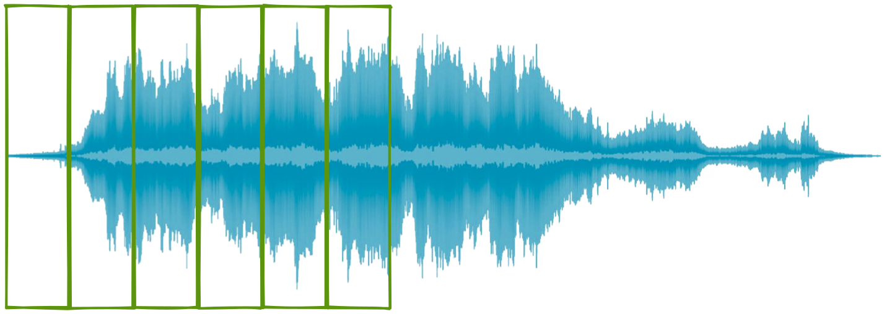

###### 2.2.2.2.2. Overlapping Frames


**Hop Length**: amount of samples that we shift to the right every time we take a new frame

## 3. Time Domain Audio Feature

### 3.1. Amplitude Envelope (振幅包络) - AE

#### 3.1.1. Mathematic

**每个 frame 中采样点的最大振幅：**

$$
AE_t=\max_{k=t\cdot K}^{(t+1)\cdot K-1}s(k)
$$

$s(k):$ Amplitude of $kth$ sample
$AE_t:$ Max amplitude value of all samples in a frame, 也就是从第 $t \cdot K$ 个采样点到到$(t+1)\cdot K-1$个采样点中最大的振幅值


**最后计算所有 frame 中采样点的最大振幅：**
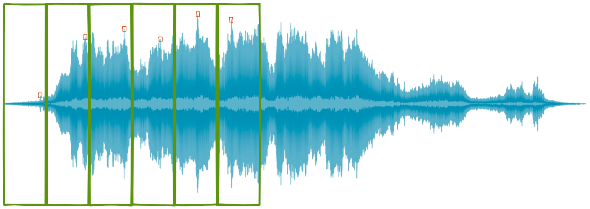

#### 3.1.2. 特点和作用

- Gives rough idea of loudness
- Sensitive to outliers - 对异常敏感
- Onset detection - 检测某个 note 的开始位置，比如某个音节的开始，语音中某个文字的开始
- music genre classification - 音乐流派分类

#### 3.1.3. CODE

**Loading Audio Files**

```python
import matplotlib.pyplot as plt  
import numpy as np  
import librosa  
import librosa.display  
  
debussy_file = "audio/debussy.wav"  
redhot_file = "audio/redhot.wav"  
duke_file = "audio/duke.wav"  
  
debussy, sample_rate = librosa.load(debussy_file)  
redhot, _ = librosa.load(redhot_file)  
duke, _ = librosa.load(duke_file)
```

**Basic Information Regarding Audio Files**

```python
print(f'sample rate: {sample_rate}')  
  
# duration in seconds of 1 sample  
sample_duration = 1 / sample_rate  
print(f"One sample lasts for {sample_duration:6f} seconds")  
  
# total number of samples in audio file  
total_samples = len(debussy)  
print(f"debussy has {total_samples} samples")  
  
# duration of debussy audio in second  
duration = sample_duration * total_samples  
print(f"The audio lasts {duration} seconds")

>>> sample rate: 22050
>>> One sample lasts for 0.000045 seconds
>>> debussy has 661500 samples
>>> The audio lasts 30.0 seconds
```

**Visualising Audio Signal in the Time Domain**

```python
# Visualising audio signal in the time domain
plt.figure(figsize=(15, 17))
plt.subplot(3, 1, 1)
librosa.display.waveplot(debussy, alpha=0.5)
plt.ylim((-1, 1))
plt.title("Debussy")

plt.subplot(3, 1, 2)
librosa.display.waveplot(redhot,alpha=0.5)
plt.ylim((-1,1))
plt.title("Redhot")

plt.subplot(3,1,3)
librosa.display.waveplot(duke, alpha=0.5)
plt.ylim((-1,1))
plt.title("Duke Ellington")
```

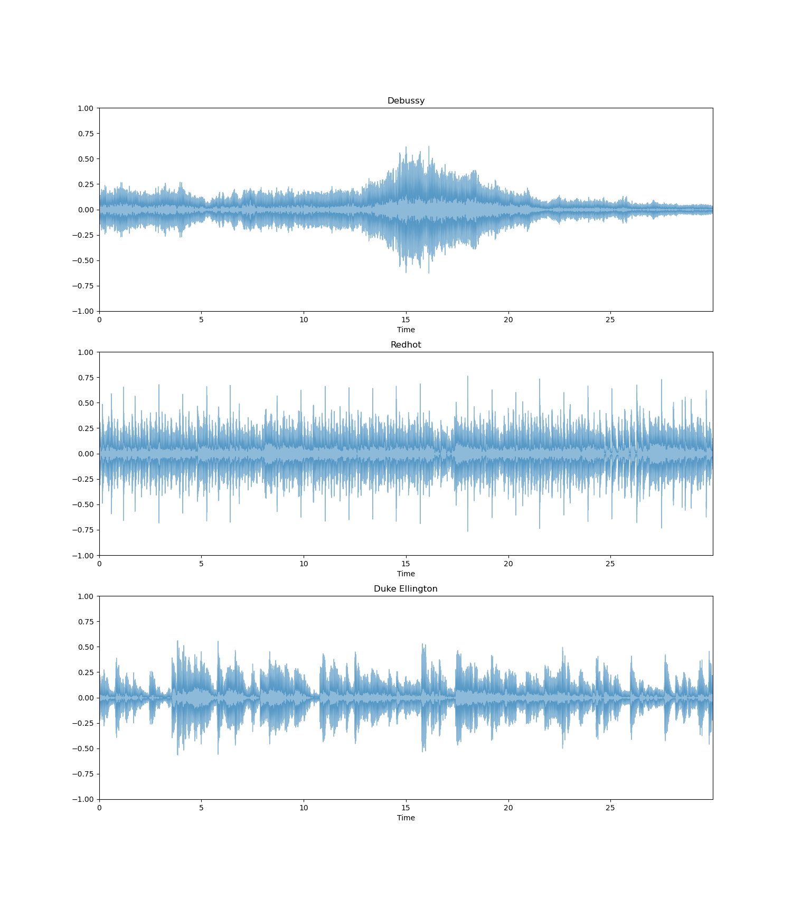
**没有 Overlapping 的情况**

每隔 `frame_size` 取一个 frame (`frame_size`) 中最大的

```python
def amplitude_envelop(signal, frame_size):
    amplitude_envelop_list = []

    # calculate AE for each frame
    for i in range(0, len(signal), frame_size):
        current_frame_amplitude_envelope = max(signal[i:i + frame_size])
        amplitude_envelop_list.append(current_frame_amplitude_envelope)
    return np.array(amplitude_envelop_list)

FRAME_SIZE = 512
ae_debussy = amplitude_envelop(debussy, FRAME_SIZE)
print(f"There are {len(ae_debussy)} frame in debussy")

>>> 646
```

**有 Overlapping 的情况**

每隔 `hop_length` 取 frame (`frame_size`)中最大的

```python
# Calculating amplitude envelope - non overlapping
def amplitude_envelop(signal, frame_size, hop_length):
    amplitude_envelop_list = []

    # calculate AE for each frame
    for i in range(0, len(signal), hop_length):
        current_frame_amplitude_envelope = max(signal[i:i + frame_size])
        amplitude_envelop_list.append(current_frame_amplitude_envelope)
    return np.array(amplitude_envelop_list)

FRAME_SIZE =1024
HOP_LENGTH=512
ae_debussy = amplitude_envelop(debussy, FRAME_SIZE,HOP_LENGTH)
print(f"Overlapping: There are {len(ae_debussy)} frame in debussy")

>>> 1292
```

**简化写法**：

```python
def amplitude_envelope(signal, frame_size, hop_length):
    """Fancier Python code to calculate the amplitude envelope of a signal with a given frame size."""
    return np.array([max(signal[i:i+frame_size]) for i in range(0, len(signal), hop_length)])

FRAME_SIZE =1024
HOP_LENGTH=512
ae_debussy = amplitude_envelop(debussy, FRAME_SIZE,HOP_LENGTH)
print(f"Overlapping: There are {len(ae_debussy)} frame in debussy")

# calculate amplitude envelope for RHCP and Duke Ellington
ae_redhot = amplitude_envelope(redhot, FRAME_SIZE, HOP_LENGTH)
ae_duke = amplitude_envelope(duke, FRAME_SIZE, HOP_LENGTH)
```

**Visualising Amplitude Envelope**

```python
frames_index = range(len(ae_debussy))
time_of_frames = librosa.frames_to_time(frames_index, hop_length=HOP_LENGTH)
frame_duration = 1 / sample_rate * HOP_LENGTH
print(f"{frame_duration:.6f}")
print(f"前两帧所对应的时间：frame 0: {time_of_frames[0]:.6f}; frame 1: {time_of_frames[1]:.6f}")

# amplitude envelope is graphed in red
plt.figure(figsize=(15, 17))

ax = plt.subplot(3, 1, 1)
librosa.display.waveplot(debussy, alpha=0.5)
plt.plot(time_of_frames, ae_debussy, color='r')
plt.ylim((-1, 1))
plt.title("Debussy")
plt.subplot(3, 1, 2)
librosa.display.waveplot(redhot, alpha=0.5)
plt.plot(time_of_frames, ae_redhot, color='r')
plt.ylim((-1, 1))
plt.title("Redhot")
plt.subplot(3, 1, 3)
librosa.display.waveplot(redhot, alpha=0.5)
plt.plot(time_of_frames, ae_duke, color='r')
plt.ylim((-1, 1))
plt.title("Duke")
plt.show()
```


### 3.2. Root-mean-square Energy (均方根能量) - RMS

We took the root means square of all the samples in a frame.

#### 3.2.1. 特点和作用

- Indicator of loudness
- Less sensitive to outliers than AE
- Audio segmentation -  RMS tends to change quite a lot when you have new segment，比如用来检测是否有人在说话
- music genre classification

#### 3.2.2. Mathematic

**Root-mean-square energy at time t:**

$$
RMS_{t}=\sqrt{\frac{1}{K} \cdot \sum_{k=t \cdot K}^{(t+1) \cdot K-1} s(k)^{2}}
$$

$s(k):$Amplitude of $kth$ sample
$s(k)^2:$energy of $kth$ sample
$\sum_{k=t \cdot K}^{(t+1) \cdot K-1}:$Sum of energy for all samples in frame $t$
$\frac{1}{K}:$Mean of sum of energy

#### 3.2.3. CODE

```python
# %% Calculate Root-mean-Square Energy (RMS)  
FRAME_SIZE = 1024  
HOP_LENGTH = 512  
  
rms_debussy = librosa.feature.rms(debussy, frame_length=FRAME_SIZE, hop_length=HOP_LENGTH)[0]  
rms_redhot = librosa.feature.rms(redhot, frame_length=FRAME_SIZE, hop_length=HOP_LENGTH)[0]  
rms_duke = librosa.feature.rms(duke, frame_length=FRAME_SIZE, hop_length=HOP_LENGTH)[0]  
  
len(rms_debussy)  
```

```python
# visualize  
frames_index = range(len(rms_debussy))  
time_of_frames = librosa.frames_to_time(frames_index, sr=22050, hop_length=HOP_LENGTH)  
frame_duration = 1 / sample_rate * HOP_LENGTH  
print(f"{frame_duration:.6f}")  
print(f"前两帧所对应的时间：frame 0: {time_of_frames[0]:.6f}; frame 1: {time_of_frames[1]:.6f}")  
  
plt.figure(figsize=(15,17))  
ax = plt.subplot(3,1,1)  
librosa.display.waveshow(debussy,alpha=0.5)  
plt.plot(time_of_frames,rms_debussy,color='r')  
plt.ylim((-1,1))  
plt.title("Debussy")  
  
plt.subplot(3,1,2)  
librosa.display.waveshow(redhot,alpha=0.5)  
plt.plot(time_of_frames,rms_redhot,color="r")  
plt.ylim((-1,1))  
plt.title("Redhot")  
  
plt.subplot(3,1,3)  
librosa.display.waveshow(duke,alpha=0.5)  
plt.plot(time_of_frames,rms_duke,color="r")  
plt.ylim((-1,1))  
plt.title("Duke")  
  
plt.show()
```


### 3.3. Zero Crossing Rate(过零率) - ZCR

Number of times a signal crosses the horizontal axis

过零率（zero-crossing rate，ZCR）是指一个信号的符号变化的比率，例如信号从正数变成负数，或反过来。这个特征已在语音识别和音乐信息检索领域得到广泛使用，是分类敲击声的关键特征。

$$
Z C R_{t}=\frac{1}{2} \cdot \sum_{k=t \cdot K}^{(t+1) \cdot K-1}|\operatorname{sgn}(s(k))-\operatorname{sgn}(s(k+1))| / frame\_size
$$

- $sgn(s(k))$
	- $s(k) > 0$ → +1
	- $s(k) < 0$ → -1
	- $s(k) = 0$ → 0


- Recognition of percussive(敲击) vs pitched sounds - 敲击的声音的过零率一般都比较大
- Voice/unvoiced decision for speech signals - voice 一般比较低
-

#### 3.3.1. CODE

**Calculate Zero-crossing rate**

```python
FRAME_SIZE = 1024  
HOP_LENGTH = 512  
  
zcr_debussy = librosa.feature.zero_crossing_rate(debussy, frame_length=FRAME_SIZE, hop_length=HOP_LENGTH)[0]  
zcr_redhot = librosa.feature.zero_crossing_rate(redhot, frame_length=FRAME_SIZE, hop_length=HOP_LENGTH)[0]  
zcr_duke = librosa.feature.zero_crossing_rate(duke, frame_length=FRAME_SIZE, hop_length=HOP_LENGTH)[0]
```

**Visualising ZCR**

Zero-crossing Rate 


```python
print(zcr_debussy.size)  
frames_index = range(zcr_debussy.size)  
time_of_frames = librosa.frames_to_time(frames_index, sr=22050, hop_length=HOP_LENGTH)  
  
# Visualise zero-crossing rate with Librosa  
plt.figure(figsize=(15, 10))  
  
plt.plot(time_of_frames, zcr_debussy, color="y")  
plt.plot(time_of_frames, zcr_redhot, color="r")  
plt.plot(time_of_frames, zcr_duke, color="b")  
plt.ylim(0, 1)  
plt.show()
```


Zero-crossing Number 

```python
FRAME_SIZE = 1024  
HOP_LENGTH = 512  
  
zcr_debussy = librosa.feature.zero_crossing_rate(debussy, frame_length=FRAME_SIZE, hop_length=HOP_LENGTH)[0]  
zcr_redhot = librosa.feature.zero_crossing_rate(redhot, frame_length=FRAME_SIZE, hop_length=HOP_LENGTH)[0]  
zcr_duke = librosa.feature.zero_crossing_rate(duke, frame_length=FRAME_SIZE, hop_length=HOP_LENGTH)[0]  
  
print(zcr_debussy.size)  
frames_index = range(zcr_debussy.size)  
time_of_frames = librosa.frames_to_time(frames_index, sr=22050, hop_length=HOP_LENGTH)  
  
# Visualise zero-crossing rate with Librosa  
plt.figure(figsize=(15, 10))  
  
plt.plot(time_of_frames , zcr_debussy * FRAME_SIZE, color="y")  
plt.plot(time_of_frames , zcr_redhot * FRAME_SIZE, color="r")  
plt.plot(time_of_frames , zcr_duke * FRAME_SIZE, color="b")  
plt.ylim(0, 500)  
plt.show()
```


**对比谈话和白噪音的 ZCR**


```python
#%% 对比谈话和白噪音的 ZCR
voice_file = "audio/voice.wav"  
noice_file = "audio/noise.wav"  
  
voice, _ = librosa.load(voice_file,duration=15)  
noise, _ = librosa.load(noice_file, duration=15)  
  
zcr_voice = librosa.feature.zero_crossing_rate(voice,frame_length=FRAME_SIZE, hop_length=HOP_LENGTH)[0]  
zcr_noice = librosa.feature.zero_crossing_rate(noise,frame_length=FRAME_SIZE,hop_length=HOP_LENGTH)[0]  
  
frames = range(len(zcr_voice))  
time_of_frames = librosa.frames_to_time(frames,hop_length=HOP_LENGTH)  
  
plt.figure(figsize=(15,10))  
plt.plot(time_of_frames,zcr_voice,color="y")  
plt.plot(time_of_frames,zcr_noice,color="r")  
plt.ylim(0,1)  
plt.show()
```


# 傅里叶分析

 [纯干货数学推导_傅里叶级数与傅里叶变换_Part6_总结与闲话（完）_哔哩哔哩_bilibili](https://www.bilibili.com/video/BV1St41117fH)
 [傅里叶变换学习心得 - 知乎](https://zhuanlan.zhihu.com/p/66117227)
[[长文笔记]面向机器学习的语音信号处理(二) - 知乎](https://zhuanlan.zhihu.com/p/356364039)
 [信号与系统课程 180 讲（大连大学李泽光）_哔哩哔哩_bilibili](https://www.bilibili.com/video/BV13b4y1C7VX?p=28)

[复数形式傅里叶变换的物理意义中，相位究竟指的是什么？ - 知乎](https://www.zhihu.com/question/20977844/answer/99503904)
## 1. FT 能干什么

**将复杂的声音分解为其频率分量，将时域转换到频域**

- 横轴：Frequency
- 纵轴：某一个频率在整个 signal 中的重要性


### 3.2. 傅里叶变换的过程

选择一个频率 -> 选择最优的相位 -> 计算 magnitude，然后重复这个过程。


#### 3.2.1. 选择最优的相位

给定了频率 f 之后，如何确定最优相位的公式，其实就是求使上图填充面积最大的$\varphi$:

$$
\varphi_{f}=\operatorname{argmax}_{\varphi \in[0,1)}\left(\int s(t) \cdot \sin (2 \pi \cdot(f t-\varphi)) dt\right)
$$

其中 $s(t) \cdot \sin (2 \pi \cdot(f t-\varphi))$ 就是求原始信号和 sinusoid 相似性

#### 3.2.2. 计算 Magnitude

取填充部分面积最大的面积值

$$
d_{f}=\max _{\varphi \in[0,1)}\left(\int s(t) \cdot \sin (2 \pi \cdot(f t-\varphi))  dt\right)
$$

### 3.3. Reconstructing a Signal - 逆傅里叶变换

- Superimpose sinusoids - 叠加正弦波
- Weight them by the relative magnitude
- Use relative phase
- Original signal and FT have same information


有若干正弦波，然后基于加法合成得到结果。可以在如下网址尝试：
<<https://teropa.info/harmonics-explorer/>>


# Discrete Fourier Transform (DFT)

 [深入理解离散傅里叶变换(DFT) - 知乎](https://zhuanlan.zhihu.com/p/71582795)

离散傅里叶变换（Discrete Fourier Transform，缩写为 DFT），是傅里叶变换在**时域**和**频域**上都呈离散的形式，将信号的时域采样变换为其频域采样。

在形式上，变换两端（时域和频域上）的序列是**有限长**的。

## 1. Digital Signal

Moving from continuous Fourier Transform to Discrete Fourier Transform

$T$ 为采样周期


## 2. 由连续到离散

在离散区间上实现傅里叶变换的公式：

- 对有限区间进行采样
- 对有限个频率进行傅里叶变换
- $\#frequencies(M) = \#samples(N)$ - **频率的取值的数量** = **采样点的数量**


因为频率取值数量和采样点数量一致，那频率$f$ 的取值范围就是$[0,M-1]$, 我们可以用$k$来表示第几个 sample 位置


## 3. 离散傅里叶变换中的频率

连续函数的频率为

$$
\frac{1}{T}
$$

离散函数频率为

$$
F(k)=\frac{k}{NT}=\frac{ks_r}{N} \quad k\in[0,N-1]
$$

当$k=0$时，频率为 0，当$k=N-1$时，频率接近与采样率。

## 4. 公式

**DFT：**

$$
X[k]=\sum_{n=0}^{N-1} x[n] e^{-j(2 \pi / N) k n} \quad (0 \leq k \leq N-1)
$$

**DFT 的逆变换式：**

$$
x[n]=\frac{1}{N} \sum_{k=0}^{N-1} X[k] e^{j(2 \pi / N) k n} \quad (0 \leq n \leq N-1)
$$

## 5. 共轭

实数信号变换的结果$X[k]$是一组复数，里面一半数据和另一半是共轭的，意味着 N 点 DFT，只有 N/2 的数据是含有有用信息的。

我们只考虑在$[0,s_r/2]$之间的频率，奈奎斯特频率


## 6. Fast Fourier Transform

- DFT is computationally expensive ($N^2$)
- FFT is more efficient ($Nlog_2N$)
- FFT exploits redundancies across sinusoids
- FFT works when $N$ is a power of $2$


## 8. Code - Extract Fourier Transform

```python
import numpy as np
import matplotlib.pyplot as plt
import os
import librosa

BASE_DIR = 'audio/'

violin_sound_file = "violin_c.wav"
piano_sound_file = "piano_c.wav"
sax_sound_file = "sax.wav"
noise_sound_file = "noise.wav"

# load sounds
violin_c4, sr = librosa.load(os.path.join(BASE_DIR, violin_sound_file))
piano_c5, _ = librosa.load(os.path.join(BASE_DIR, piano_sound_file))
sax_c4, _ = librosa.load(os.path.join(BASE_DIR, sax_sound_file))
noise, _ = librosa.load(os.path.join(BASE_DIR, noise_sound_file))

len(violin_c4)  # 59772
X = np.fft.fft(violin_c4)
len(X)  # 59772

def plot_magnitude_spectrum(signal, sr, title, f_ratio=1.0):
    X = np.fft.fft(signal)
    X_mag = np.absolute(X)

    plt.figure(figsize=(18, 5))

    f = np.linspace(0, sr, len(X_mag))
    f_bins = int(len(X_mag) * f_ratio)

    plt.plot(f[:f_bins], X_mag[:f_bins])
    plt.xlabel('Frequency (Hz)')
    plt.title(title)
```

```python
plot_magnitude_spectrum(violin_c4, sr, "violin", f_ratio=0.1)
```

![[Pasted image 20220103210242.png]]

```python
plot_magnitude_spectrum(piano_c5, sr, "piano", 0.1)
```

![[Pasted image 20220103210252.png]]

```python
plot_magnitude_spectrum(sax_c4, sr, "sax", 0.1)
```

![[Pasted image 20220103210300.png]]

```python
plot_magnitude_spectrum(noise, sr, "noise", 0.1)
plt.show()
```

![[Pasted image 20220103210307.png]]


# Short-time Fourier Transform

之前 FT 和 DFT 都是在完整区间上做的，我们知道“哪些频率分量出现在了语音信号中”，可惜我们不知道“什么时候这些频率分量出现”，这是因为我们最终得到的 magnitude 是源信号的在所有时间上的求和。因此我们需要考虑原始信号中的率分量（如何）随时间变化。


## Spectrograms


- Time-Frequency representation of the speech signal
- Spectrogram is a tool to study speech sounds (phones)
- Phones and their properties are visually studied by phoneticians
- Hidden Markov Models implicitly model spectrograms for speech to text systems
- Useful for evaluation of text to speech systems – A high quality text to speech system should produce synthesized speech whose spectrograms should nearly match with the natural sentences.
## 1. 在局部信号区域上应用 FFT

STFT 的目的就是去定位，哪些频率分量，出现在了信号的哪些位置，解决方案：在**局部信号区域**上应用 FFT.


Time Vs Frequency representation of a speech signal is referred to as spectrogram

Phones and their properties are better observed in spectrogram


## 2. Windowing

Apply windowing function to signal

图中红线为 windowing function，一般 window size = frame size


有时 frame size != frame size，需要在做完 windowing 以后加上 zero padding


## 3. Overlapping


## 4. From DFT to STFT


$m$: 第几个 frame
$n$: $[0,frame\_size-1]$
$H$: Hop size
$mH$: Starting sample of current frame-当前帧采样的起始位置

## 5. DFT 和 STFT 的输出的区别：

**DFT - 离散傅里叶变换**

- Spectral vector (#frequency bins) ，每个频率一个复数对应（magnitude, phase)
- N complex Fourier coefficients，设采样点数量为 N，则一共输出的是 N 个复数的“傅里叶系数”

**STFT - 短时傅里叶变换**

- Spectral matrix (**# frequency bins, # frames**) ：频率矩阵，**# frequency bins** 表示在这一阵中的各频率分量，**# frames** 对应着时间
- Complex Fourier coefficients - 复数形式的傅里叶系数

## 6. Output

frame_size 除以 2 是要除去共轭部分。


**STFT 的输出的示例**：

- Signal = 10K samples
- Frame size = 1000
- Hop size = 500

$$
frequency\_bins = \frac{1000}{2} + 1 = 501
$$

$$
frames = \frac{10000-1000}{500} + 1 = 19
$$

STFT output shape: (501,19)

前面一个 501 代表的是 frequency 信息；后面的 19 代表一共有 19 个 frame

## 7. STFT Parameters

### 7.1. Frame Size

取值： 512,1024,2048,4096,8192

当增大 frame size 的时候，即一个 frame 中的 sample 采样点的数量增大的时候，则因为 freq 频率是$(\#frame\_size)/2+1$，所以，freq resolution 提高（包括的频率的数量提高）；同时，因为 frame size 增大，则相同的一段语音，能够被切分成的 frame 的数量减少。（例如 10000 秒的音频，当 frame=1 的时候，可以被切成 10000 份，而当 frame=1000 的时候，只有 10 份了）。反之亦然。

### 7.2. Hop Size

取值： 256,512,1024,2048,4096

即，hop size=$\frac{1}{2}K$, $\frac{1}{4}K$, $\frac{1}{8} K$ （这里的 K 代表的是 frame size)

### 7.3. Windowing Function

剩余的最重要的一个要素，是 “分窗函数”，例如，下图展示了一个 Hann 分窗函数的定义和图像：（90% 的情况下此函数被使用）

**见前边章节相关内容**

## 8. 声音”可视化“

具体操作是把 STFT 的 output matrix 进行求模操作


## 9. CODE - Extract Spectrograms

```python
import os
import librosa
import librosa.display
import IPython.display as ipd
import numpy as np
import matplotlib.pyplot as plt

# Loading audio files with Librosa
scale_file = "audio/scale.wav"
debussy_file = "audio/debussy.wav"
redhot_file = "audio/redhot.wav"
duke_file = "audio/duke.wav"

# load audio files with librosa
scale, sr = librosa.load(scale_file)
debussy, _ = librosa.load(debussy_file)
redhot, _ = librosa.load(redhot_file)
duke, _ = librosa.load(duke_file)

# Extracting Short-Time Fourier Transform
FRAME_SIZE = 2048
HOP_SIZE = 512

S_scale = librosa.stft(scale, n_fft=FRAME_SIZE, hop_length=HOP_SIZE)
# (frame/2+1, number of frame)
print(S_scale.shape)  # (1025, 342)
print(type(S_scale[0][0]))  # <class 'numpy.complex64'>

# Calculating the spectrogram
Y_scale = np.abs(S_scale) ** 2
print(Y_scale.shape)  # (1025, 342)
print(type(Y_scale[0][0]))  # <class 'numpy.float32'>

# Visualizing the spectrogram
def plot_spectrogram(Y, sr, hop_length, y_axis="linear"):
    plt.figure(figsize=(25, 10))
    librosa.display.specshow(Y,
                             sr=sr,
                             hop_length=hop_length,
                             x_axis="time",
                             y_axis=y_axis)
    plt.colorbar(format="%+2.f")

plot_spectrogram(Y_scale, sr, HOP_SIZE)
plt.show()
```


我们感知声音强弱并不是线性的，而是 logarithmic 形式的，我们需要将 intensity 转化为分贝的形式

```python
# Log-Amplitude Spectrogram
Y_log_scale = librosa.power_to_db(Y_scale)
plot_spectrogram(Y_log_scale, sr, HOP_SIZE)
plt.show()
```


```python
# Log-Amplitude Spectrogram
# frequency 也是 log 形式的
plot_spectrogram(Y_log_scale, sr, HOP_SIZE, y_axis="log")
plt.show()
```


```python
# Visualising songs from different genres
S_debussy = librosa.stft(debussy, n_fft=FRAME_SIZE, hop_length=HOP_SIZE)
S_redhot = librosa.stft(redhot, n_fft=FRAME_SIZE, hop_length=HOP_SIZE)
S_duke = librosa.stft(duke, n_fft=FRAME_SIZE, hop_length=HOP_SIZE)

Y_debussy = librosa.power_to_db(np.abs(S_debussy) ** 2)
Y_redhot = librosa.power_to_db(np.abs(S_redhot) ** 2)
Y_duke = librosa.power_to_db(np.abs(S_duke) ** 2)

plot_spectrogram(Y_debussy, sr, HOP_SIZE, y_axis="log")
plt.show()

plot_spectrogram(Y_redhot, sr, HOP_SIZE, y_axis="log")
plt.show()

plot_spectrogram(Y_duke, sr, HOP_SIZE, y_axis="log")
plt.show()

```

德彪西，古典


red hot, 摇滚


Duke Ellington, jazz


# Mel Spectrograms
[梅尔频谱(mel spectrogram)原理与使用 - 知乎](https://zhuanlan.zhihu.com/p/351956040)
[STFT和声谱图，梅尔频谱（Mel Bank Features）与梅尔倒谱（MFCCs）_sc一号的博客-CSDN博客_梅尔频谱](https://blog.csdn.net/qq_28006327/article/details/59129110)
[Audio Deep Learning Made Simple (Part 2): Why Mel Spectrograms perform better | by Ketan Doshi | Towards Data Science](https://www.agora.io/cn/community/blog-123-category-21571)
[Audio Deep Learning Made Simple (Part 2): Why Mel Spectrograms perform better | by Ketan Doshi | Towards Data Science](https://towardsdatascience.com/audio-deep-learning-made-simple-part-2-why-mel-spectrograms-perform-better-aad889a93505)
[https://lxkaka.wang/audio-process/](https://lxkaka.wang/audio-process/)


**总的来说就是把上一章中 Spectrogram (声谱图)的 frequency 从 linear 转成 Mel Spectrograms (梅尔频谱图) 的 log 形式**

X 轴为时间，Y 轴为 Frequency ，每一个点表示在每个时间点呈现某个频率的强度


**Psychoacoustic experiment - 心理声学的实验**

- 1st sample: C2 - C4 -> (65-262Hz) 差距为 197Hz
- 2nd sample: G6 - A6 -> (1568-1760Hz) 差距为 192Hz

~ 200 Hz （两种跳跃的间隔都是 200Hz 左右），而听起来差距很大，这是因为人类是以**对数**的方式来感知“频率”的！

**Mel spectrograms （梅尔谱）** 音声特征，满足下面三个条件：

- Time-frequency representation - 时域-频域表示
- Perceptually-relevant amplitude representation - 感知相关的“幅度”表示方法
- Perceptually-relevant frequency representation - 感知相关的“频率”表示方法

**Mel-Frequency Analysis**

- Mel-Frequency analysis of speech is based on **human perception** experiments
- It is observed that human ear acts as filter – It concentrates on only certain frequency components
- These filters are non-uniformly spaced on the frequency axis
	- More filters in the low frequency regions
	- Less no. of filters in high frequency regions

## 1. Mel-scale

Mel 是 melody 的缩写，梅尔标度，the Mel scale，由 Stevens, Volkmann 和 Newman 在 1937 年命名。我们知道，频率的单位是赫兹（Hz），人耳能听到的频率范围是 20-20000Hz，但人耳对 Hz 这种标度单位并不是线性感知关系。例如如果我们适应了 1000Hz 的音调，如果把音调频率提高到 2000Hz，我们的耳朵只能觉察到频率提高了一点点，根本察觉不到频率提高了一倍。

- Logarithmic scale
- Equal distances on the scale have same “perceptual” distance - 在“梅尔刻度”上，相同的距离，有相同的“感知距离”
- 1000 Hz = 1000 Mel

如果将普通的频率标度$f$转化为梅尔频率标度$m$，映射关系如下式所示：

$$
\begin{aligned}
&m=2595 \cdot \log_{10} \left(1+\frac{f}{700}\right) \\
&f=700\left(10^{m / 2595}-1\right)
\end{aligned}
$$

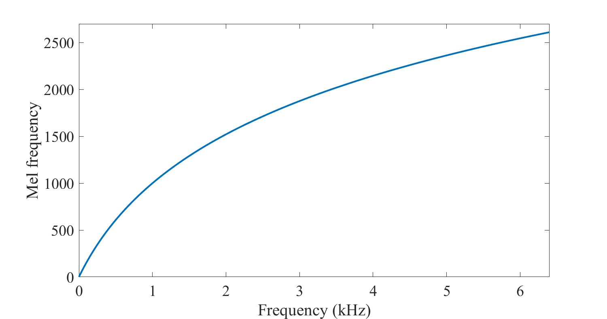

## 2. Extract Mel Spectrogram

1. Extract STFT
2. Convert amplitude to DBs
3. Convert frequencies to Mel scale

### 2.1. Convert Frequencies to Mel Scale

1. Choose number of Mel bands
2. Construct Mel filter banks
3. Apply Mel filter banks to spectrogram

从 Hz 到 Mel 的映射，由于它们是 log 的关系，当频率较小时，mel 随 Hz 变化较快；当频率很大时，mel 的上升很缓慢，曲线的斜率很小。这说明了人耳对低频音调的感知较灵敏，在高频时人耳是很迟钝的，梅尔标度滤波器组启发于此。

- More no. of filters in low freq. region
- Lesser no. of filters in high freq. region

如上图所示，40 个三角滤波器组成滤波器组，低频处滤波器密集，门限值大，高频处滤波器稀疏，门限值低。恰好对应了频率越高人耳越迟钝这一客观规律。上图所示的滤波器形式叫做等面积梅尔滤波器（Mel-filter bank with same bank area），在人声领域（语音识别，说话人辨认）等领域应用广泛，但是如果用到非人声领域，就会丢掉很多高频信息。这时我们更喜欢的或许是等高梅尔滤波器（Mel-filter bank with same bank height）：


#### 2.1.1. Choose Number of Mel Bands - 选择 Mel 频段的数量

具体问题具体分析，一般作为超参数 (hyper-parameter): 40,60,90,128

#### 2.1.2. Construct Mel Filter Banks

##### 2.1.2.1. Convert Lowest / Highest Frequency to Mel

使用公式得到两个端点，min 和 max

$$
m=2595 \cdot \log_{10} \left(1+\frac{f}{700}\right)
$$

##### 2.1.2.2. Create # Bands Equally Spaced Points

在 Mel-scale 上，对[min, max]，等份切割，得到点集合（一共 M+1 个点，其中 M 是前面选好的 Mel bands 的数量）

假设我们选择 7 个 Mel Band


##### 2.1.2.3. Convert Points Back to Hertz

Point 指的是 center frequency of different Mel bands

$$
\begin{aligned}
f=700\left(10^{m / 2595}-1\right)
\end{aligned}
$$

##### 2.1.2.4. Round to Nearest Frequency Bin

将求得的 frequency 四舍五入到最近的 frequency bin, 因为 $\#frequency \_bin=\#frame\_size$，把 Mel-scale 的频率映射回 Hz 单位的频率，这个时候就需要参考 Hz 单位频率的取值范围，参照的是 frequency bin

##### 2.1.2.5. Create Triangular Filters

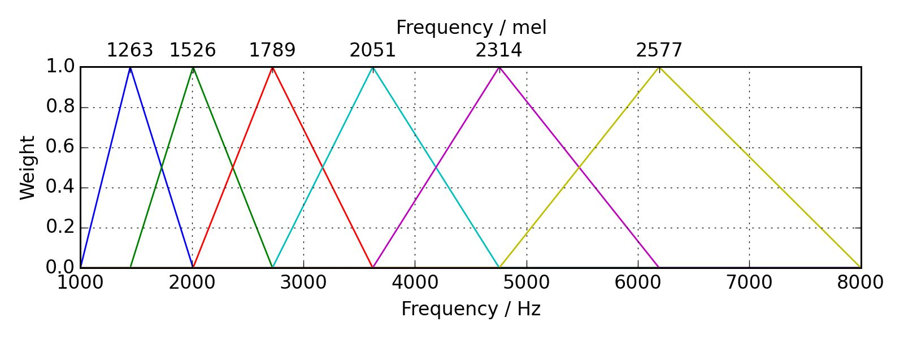

x 轴为 frequency，单位 Hz
顶部的 x 轴上为 Mel scale, 单位 Mel

在 y 轴上，我们有 weight，取值在$[0.0,1.0]$区间。为什么需要 weight？因为这些是滤波器，他们的功能就是 filter sounds。特别的当 weight=1.0 的时候，you are not touching that signal，没有进行任何过滤。但是，当 weight<1.0 的时候，我们做的就类似于 dumping down the signal.

我们有 6 个 Mel bands，分别是 1263,1526,1789,2051,2314,2577（相邻 Mel band 之间的差距为 263 左右，等距分布的）。他们对应的频率 Hz 分别为：1446,2011,2723,3619,4755,6189（不是等距分布的）

接下来看第二个 Mel band, 它的 center point 为 1526 Mel，它的左端点和右端点都取自上一个和下一个 Mel band 的中心点，在端点处，他们的 weight 取值为 0，也就是说在两端点以外的区域都为静音，被过滤掉了。


**Mel filter banks matrix shape**： $(\#bands, \frac{framesize}{2}+1)$
在此例中为 $\#bands=6$

#### 2.1.3. Applying Mel Filter Banks to Spectrogram

**Mel filter banks matrix shape**： $(\#bands, \frac{\#framesize}{2}+1)$

**STFT Output Spectrogram matrix shape**: $(\frac{\#framesize}{2}+1,\#frames)$

$$
Mel\ spectrogram =MY
$$

通过这两个矩阵的乘积，得到的结果的 shape 是：$(\# bands, \# frames)$

**Spectrogram**

y 轴为 linear 形式

**Mel Spectrogram**

y 轴为 log 形式


上图中：横轴还是 Time 按照 frame 值展示，不同的在于纵轴，不同的 frequency bins 使用 Mel bands 表示而不是像 spectrogram 中的线性表示，each frequency bin is a different Mel band which is perceptually relevant, and then each point that we have here, it has an associated color that represents how present a certain Mel band is at a certain point in time.

## 3. Code

```python
import librosa  
import librosa.display  
import IPython.display as ipd  
import matplotlib.pyplot as plt  
  
# Loading audio files with Librosa  
scale_file = "audio/scale.wav"  
scale, sr = librosa.load(scale_file)
```

**Mel filter banks matrix shape**： $(\#bands, \frac{\#framesize}{2}+1)$
$\#bands = 10$
$2048/2+1 = 1025$

```python
# Mel filter banks  
filter_banks = librosa.filters.mel(n_fft=2048, sr=22050, n_mels=10)  
print(filter_banks.shape)  
  
# Visualize Mel filter banks  
# x 轴代表的是frequency，[0, sr/2]  
# 颜色深浅可以理解为是weight  
import matplotlib.pyplot as plt  
fig, ax = plt.subplots()  
img = librosa.display.specshow(filter_banks, x_axis='linear', ax=ax)  
ax.set(ylabel='Mel filter', title='Mel filter bank')  
fig.colorbar(img, ax=ax)  
plt.show()

```


```python
# Extracting Mel Spectrogram  
mel_spectrogram = librosa.feature.melspectrogram(scale, sr=sr, n_fft=2048, hop_length=512, n_mels=10)  
print(mel_spectrogram.shape)  # (10, 342) 

log_mel_spectrogram = librosa.power_to_db(mel_spectrogram)  
print(log_mel_spectrogram.shape)  # (10, 342)   

# Visualize Mel Spectrogram
plt.figure(figsize=(25, 10))  
librosa.display.specshow(log_mel_spectrogram,  
 x_axis="time",  
 y_axis="mel",  
 sr=sr)  
plt.colorbar(format="%+2.f")  
plt.show()
```

下图为 10 bands 时候的图像


下图为 90 bands 时候的图像


# Mel-Frequency Cepstral Coefficients (MFCC)

- 以下部分笔记截图来自： [www.speech.cs.cmu.edu/15-492/slides/03_mfcc.pdf](http://www.speech.cs.cmu.edu/15-492/slides/03_mfcc.pdf)
- [语音信号的梅尔频率倒谱系数(MFCC)的原理讲解及python实现 - 凌逆战 - 博客园](https://www.cnblogs.com/LXP-Never/p/10918590.html#blogTitle10)
- 
- Mel-Spectrogram and MFCCs | Lecture 72 (Part 1) | Applied Deep Learning
	- [GitHub - maziarraissi/Applied-Deep-Learning: Applied Deep Learning Course](https://www.youtube.com/watch?v=hF72sY70_IQ)
	- [ppt pdf](imgs/2022_01_06-GuanyuHu-Audio_Signal_Processing/01%20-%20Recognition.pdf)
	- [GitHub - maziarraissi/Applied-Deep-Learning: Applied Deep Learning Course](https://github.com/maziarraissi/Applied-Deep-Learning)
- [AI大语音（四）| MFCC特征提取（深度解析） - 知乎](https://zhuanlan.zhihu.com/p/181718235)
- 
## 1. MFCC

MFCC 中有三个重要的概念：

**Mel-Frequency**，**Cepstral**，以及 **Coefficients**

**Mel-frequency** -> Mel-scale 下的频率；（类似和人的声音感知相关，1000Hz 以下近似线性；之上就是对数相关度了）

**Cepstral**:

- Cepstral - adj.
- Cepstrum - n. 倒频谱  -> Spectrum - n. 频谱
- quefrency - n. 倒频率 -> frequency - n. 频率
- liftering - n. 同态滤波 -> filtering - n. 过滤
- rhamonic ？ -> harmonic - 谐波

文字游戏罢了


## 2. Computing the Cepstrum

这里的$x(t)$ 为时域信号，x 轴为 Time，y 轴为 Amplitude(振幅)；

$\mathcal{DFT}[x(t)]$ 经过离散傅里叶变换得到 power spectrum，x 轴为 frequency，y 轴为 power(能量)；

$log(\mathcal{DFT}\{x(t)\})$ -> 得到 log power spectrum x 轴不变，y 轴变成 Magitude，单位为 dB；

在 Log power spectrum 的基础上，再进行一次逆傅里叶变换($\mathcal{IDFT}$)，则得到”倒频谱“。


## 3. Visualising the Cepstrum


倒频谱”的单位是“Quefrency”，上图右边的那个波峰，其名字为"1st rhamonic", it reflects the harmonic structure (谐波结构) of the original signal that is represented in a periodic way in the log power spectrum.

## 4. Spectrum

### 4.1. A Sample Speech Spectrum


## 5. 如何理解“倒频谱”

### 5.1. The Vocal Tract - 声道

Vocal tract acts as a filter


**左边：喉脉冲波**

single noisy signal, high-pitched signal, that are get generated by the vocal folds(s) (其中包括了 pitch, frequency 等信息）

**中间：声道**

filtering the speech from left-hand-side and then create the final right-hand-side speech signal (声带)  - 音色，phonemes 等信息被加进来了，例如元音和辅音

**右边：语音信号**

经过中间的”声道“产生的结果。

### 5.2. Understanding the Cepstrum

**Log-spectrum**: Log amplitude spectrum of short amount speech

- Peaks denote dominant frequency components in the speech signal
- Peaks are referred to as formants
- Formants carry the identity of the sound

**Spectral envelope**:

- smoothen the signal, take the envelope, and get the spectral envelop 包络, 上面的 pick (红色圆圈) 指定是 formants (共振峰), which carry identity of sound, provides us information about timbre about the different phonemes that we have in speech, 这依赖于你的声道的形状 (如何发声) ,
- **Sounds can be identified much better by the Formants and by their transitions**
- Formants and a smooth curve connecting them
- This Smooth curve is referred to as spectral envelope

**Spectral detail**: subtract the two and what remains is spectral detail, it's a lot like a quickly changing information here, it maps nicely into the glottal pulse (声门的脉冲)


### 5.3. Formalising Speech

**Our goal**

We want to separate spectral envelope and spectral details from the spectrum.

**Time Domain**

人的发声过程可以看作是肺里的气流通过声带这个线性系统。如果用$e(t)$表示声音的输入激励（音高），$h(t)$表示声带的响应（也即我们需要获取的特征），那么听到的语音信号为两者的卷积:

$$
x(t) = e(t)* h(t)
$$

where $e(t)$ is glottal pulse, $h(t)$ is vocal tract frequency response

**Frequency Domain**

频域内则可以表示为两者的乘积，move time domain to frequency domain by applying FT.

$E(t)$ is glottal pulse 在频域上的函数, $H(t)$ is vocal tract 在频域上的函数

$$
\begin{gathered}
X(t)=E(t) \cdot H(t) \\
\Downarrow \\
\log (X(t))=\log (E(t) \cdot H(t)) \\
\Downarrow \\
\log (X(t))=\log (E(t))+\log (H(t))
\end{gathered}
$$

**这样就将乘法变成了加法**

我们本身只有一个 Log Spectrum，目标是把这个 Log Spectrum 切分为两个部分


### 5.4. 傅里叶逆变换

对 Log Spectrum 做傅里叶变换称为傅里叶逆变换，x 轴从 Frequency domain 到 **Quefrency** domain

IFFT of log spectrum would represent the signal in pseudo-frequency axis


**Cepstrum**

- x[k] is referred to as Cepstrum
- h[k] is obtained by considering the low frequency region of x[k].
- h[k] represents the spectral envelope and is widely used as feature for speech recognition

• Cepstral coefficients h[k] obtained for Melspectrum are referred to as Mel-Frequency Cepstral Coefficients often denoted by _MFCC_


语音信号的频谱可以看作是低频的包络和高频的细节相加，在得到倒谱系数后，我们只需要取低位的系数便可以得到包络信息。

注意整个过程中我们并没有明确计算 $e(t)$ 和 $h(t)$ ，而是通过直接对语音信号 $x(t)$ 作倒谱分析，再提取低位的倒谱系数，就可以获取我们想要的声道特征。

有意思的是，对数频谱作傅里叶反变换后的域被称为 quefrency domain（对应频域 frequency domain），quefrency domain 和时域 time domain 类似但不完全一样。提取 低位系数 的操作称为 low-time liftering（对应滤波操作 filtering）。同样地，我们可以通过 high-time liftering 来获取激励特征。

## 6. Mel Frequency Cepstral Coefficients

### 6.1. MFCC 计算步骤


到 Mel-Scaling 的地方，应该是不陌生的，即生成 Mel filter banks。

然后的一步，就有点难了：**Discrete Cosine Transform (DCT)**。类似于逆傅里叶变换( IDFT)。

**Why Discrete Cosine Transform?**

- Simplified version of Fourier Transform
- Get real-valued coefficient - gives us back real valued coefficients and this is different from what a Fourier transform does, 这里我们不需要复数 coefficients，real value coefficients are more than enough for our purposes
- Decorrelate energy in different Mel bands
- Reduce # dimensions to represent spectrum

### 6.2. How Many Coefficients? 一般需要多少系数？

- Traditionally: first 12-13 coefficients
First coefficients keep most information (e.g., formants/共振峰, spectral envelope/谱包络)
- Use Δ and ΔΔ MFCCs (first and second derivations)
	- first derivative = current frame's MFCCs - former frame's MFCCs
	- second derivative = current frame's "first derivative" - former frame's "first derivative"
- Total 39 coefficients per frame，一个 frame 里面是 39 个系数（13 是来自原来的 frame 的 MFCC 的，然后是 MFCC 的一阶 derivative 的 13 个，最后是 MCFF 的二阶 derivative13 个.）-后续有代码展示这个。

### 6.3. Visualising MFCCs

x 轴为 frames，y 轴为 coefficients
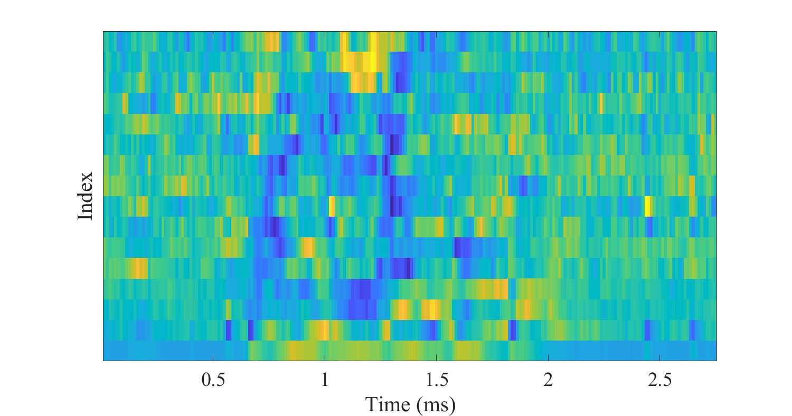

### 6.4. MFCCs Advantages

- Describe the “large” structures of the spectrum - 大的结构化信息；整体的结构化信息，about formants, about phonemes, timbre 等等
- Ignore fine spectral structures
- Work well in speech and music processing

### 6.5. MFCCs Disadvantages ：缺点

- Not robust to noise：对噪声太敏感
- Extensive knowledge engineering
- Not efficient for synthesis，合成的时候，不太好用

## 7. Code - Extract MFCC

```python
import librosa
import librosa.display
import IPython.display as ipd
import matplotlib.pyplot as plt
import numpy as np

# Loading audio files with Librosa

audio_file = "audio/debussy.wav"
# load audio files with librosa
signal, sr = librosa.load(audio_file)
```

## 8. Extracting MFCCs

```python
# Extracting MFCCs
mfccs = librosa.feature.mfcc(y=signal, n_mfcc=13, sr=sr)
print(mfccs.shape)  # (13, 1292)

# Visualising MFCCs
plt.figure(figsize=(25, 10))
librosa.display.specshow(mfccs,
                         x_axis="time",
                         sr=sr)
plt.colorbar(format="%+2.f")
plt.show()
```

![[Pasted image 20220105181219.png]]

## 9. Computing First / Second MFCCs Derivatives

```python
delta_mfccs = librosa.feature.delta(mfccs)  
delta2_mfccs = librosa.feature.delta(mfccs, order=2)  
print(delta_mfccs.shape, delta2_mfccs.shape)  # (13, 1292) (13, 1292)
```

```python
# visualize order 1
plt.figure(figsize=(25, 10))
librosa.display.specshow(delta_mfccs,
                         x_axis="time",
                         sr=sr)
plt.colorbar(format="%+2.f")
plt.show()
```

![[Pasted image 20220105181523.png]]

```python
# visualize order 2
plt.figure(figsize=(25, 10))
librosa.display.specshow(delta2_mfccs,
                         x_axis="time",
                         sr=sr)
plt.colorbar(format="%+2.f")
plt.show()
```

![[Pasted image 20220105181540.png]]

## 10. Concatenate

```python
mfccs_features = np.concatenate((mfccs, delta_mfccs, delta2_mfccs))
print(mfccs_features.shape)
plt.figure(figsize=(25, 10))
librosa.display.specshow(mfccs_features,
                         x_axis="time",
                         sr=sr)
plt.colorbar(format="%+2.f")
plt.show()
```

![[Pasted image 20220105181628.png]]


# Frequency-Domain Audio Features

- Band energy ratio (BER) - 频带能量率
- Spectral centroid (SC) - 谱心
- Bandwidth (BW) - 带宽

## 1. Extracting Frequency-domain Features


## 2. Math Conventions

- $m_t(n)$ -> Magnitude of signal at frequency bin n and frame $t$
- $N$ -> # frequency bins

## 3. Band Energy Ratio (BER)

### 3.1. 作用

- Comparison of energy in the lower/higher frequency bands
- Measure of how dominant low frequencies are

### 3.2. 公式

$m_t(n)^2$: power of magnitude
$F$: Split Frequency, 频率的分界线，见下图紫色的线(2000Hz)


下图红框为一个 Frame，BER 是绿色/蓝色的比率。


### 3.3. Band Energy Ratio applications：

- Music / speech discrimination - 音乐和语音（说话）的区别分类
- Music classification (e.g., music genre classification) - 音乐的曲风分类

## 4. Spectral Centroid (SC)- 谱心

- Centre of gravity of magnitude spectrum
- Frequency band where most of the energy is concentrated - 富含能量的频带
- Measure of “brightness” of sound - 声音响度的度量

### 4.1. 公式


### 4.2. Spectral Centroid Applications - 谱心的应用

- Audio classification - 声音分类
- Music classification - 音乐分类

## 5. Bandwidth (BW)

- Derived from spectral centroid - 衍生于”谱心“
- Spectral range around the centroid - 范围
- Variance from the spectral centroid - 与谱心的方差
- Describe perceived timbre - 感知”音色“

### 5.1. 计算公式

Weighted mean of the distances of frequency bands from SC


和方差的定义一样，BW 越大能量越分散，BW 越小能量越集中


## 6. Code

### 6.1. BER

```python
import math

import matplotlib.pyplot as plt
import numpy as np
import librosa
import IPython.display as ipd

debussy_file = "audio/debussy.wav"
redhot_file = "audio/redhot.wav"
duke_file = "audio/duke.wav"
```

**load audio files with librosa**

```python
# load audio files with librosa
debussy, sr = librosa.load(debussy_file)
redhot, _ = librosa.load(redhot_file)
duke, _ = librosa.load(duke_file)
```

**Extract spectrograms**

```python
# Extract spectrograms
FRAME_SIZE = 2048
HOP_SIZE = 512

debussy_spec = librosa.stft(debussy, n_fft=FRAME_SIZE, hop_length=HOP_SIZE)
redhot_spec = librosa.stft(redhot, n_fft=FRAME_SIZE, hop_length=HOP_SIZE)
duke_spec = librosa.stft(duke, n_fft=FRAME_SIZE, hop_length=HOP_SIZE)

print(debussy_spec.shape, debussy.shape, sr)  # (1025, 1292) (661500,) 22050
print((661500 - 2048) / 512.)  # 1287.99
```

**Calculate Band Energy Ratio**

```python
## Calculate Band Energy Ratio
def calculate_split_frequency_bin(split_frequency, sample_rate, num_frequency_bins):
    """在第几个 bin 进行高低频率分割，Infer the frequency bin associated to a given split frequency."""

    frequency_range = sample_rate / 2
    frequency_delta_per_bin = frequency_range / num_frequency_bins
    split_frequency_bin = math.floor(split_frequency / frequency_delta_per_bin)
    return int(split_frequency_bin)

split_frequency_bin = calculate_split_frequency_bin(2000, 22050, 1025)
print(split_frequency_bin)  # 185

def band_energy_ratio(spectrogram, split_frequency, sample_rate):
    """Calculate band energy ratio with a given split frequency."""

    split_frequency_bin = calculate_split_frequency_bin(split_frequency, sample_rate, len(spectrogram[0]))
    band_energy_ratio = []

    # calculate power spectrogram
    power_spectrogram = np.abs(spectrogram) ** 2

    # (1025=framesize/2+1, #frames) -> 转置之后是(#frames, framesize/2+1)
    power_spectrogram = power_spectrogram.T

    # calculate BER value for each frame
    for frame in power_spectrogram:
        sum_power_low_frequencies = frame[:split_frequency_bin].sum()
        sum_power_high_frequencies = frame[split_frequency_bin:].sum()
        band_energy_ratio_current_frame = sum_power_low_frequencies / sum_power_high_frequencies
        band_energy_ratio.append(band_energy_ratio_current_frame)

    return np.array(band_energy_ratio)

ber_debussy = band_energy_ratio(debussy_spec, 2000, sr)
ber_redhot = band_energy_ratio(redhot_spec, 2000, sr)
ber_duke = band_energy_ratio(duke_spec, 2000, sr)

len(ber_debussy) # 1292
```

**Visualise Band Energy Ratio**

```python
# Visualise Band Energy Ratio

frames = range(len(ber_debussy))
t = librosa.frames_to_time(frames, hop_length=HOP_SIZE)

plt.figure(figsize=(25, 10))

plt.plot(t, ber_debussy, color="b", label='debussy-classic')
plt.plot(t, ber_redhot, color="r", label='redhot-pop')
plt.plot(t, ber_duke, color="y", label='duke-jazz')
plt.ylim((0, 20000))
import matplotlib.font_manager as font_manager
font = font_manager.FontProperties(family='Comic Sans MS',
                                   weight='bold',
                                   style='normal', size=22)
plt.legend(prop=font, loc='upper center')
plt.show()
```

debussy-蓝色 - classic 更多是低频；redhot-红色-而 pop/rock 则更多是平衡高频和低频


### 6.2. SC

```python
sc_debussy = librosa.feature.spectral_centroid(y=debussy, sr=sr, n_fft=FRAME_SIZE, hop_length=HOP_LENGTH)[0]  
sc_redhot = librosa.feature.spectral_centroid(y=redhot, sr=sr, n_fft=FRAME_SIZE, hop_length=HOP_LENGTH)[0]  
sc_duke = librosa.feature.spectral_centroid(y=duke, sr=sr, n_fft=FRAME_SIZE, hop_length=HOP_LENGTH)[0]  
print(sc_debussy.shape) # (1292,)  
```

**Visualising spectral centroid**

```python
# Visualising spectral centroid  
frames = range(len(sc_debussy))  
t = librosa.frames_to_time(frames, hop_length=HOP_LENGTH)  
print(len(t))  # 1292  
  
plt.figure(figsize=(25,10))  
plt.plot(t, sc_debussy, color='b', label='debussy')  
plt.plot(t, sc_redhot, color='r', label='redhot')  
plt.plot(t, sc_duke, color='y', label='duke')  
  
import matplotlib.font_manager as font_manager  
font = font_manager.FontProperties(family='Comic Sans MS',  
 weight='bold',  
 style='normal', size=22)  
plt.legend(prop=font, loc='upper center')  
plt.show()  
  
```

redhot 的更高一些 = 谱心更高，频率高


### 6.3. Spectral Bandwidth with Librosa

**Calculate Spectral bandwidth with Librosa**

```python
# Spectral bandwidth with Librosa
ban_debussy = librosa.feature.spectral_bandwidth(y=debussy, sr=sr, n_fft=FRAME_SIZE, hop_length=HOP_LENGTH)[0]
ban_redhot = librosa.feature.spectral_bandwidth(y=redhot, sr=sr, n_fft=FRAME_SIZE, hop_length=HOP_LENGTH)[0]
ban_duke = librosa.feature.spectral_bandwidth(y=duke, sr=sr, n_fft=FRAME_SIZE, hop_length=HOP_LENGTH)[0]
print(ban_debussy.shape)  # (1292,)
```

**Visualising spectral bandwidth**

```python
# Visualising spectral bandwidth
plt.figure(figsize=(25,10))

plt.plot(t, ban_debussy, color='b', label='debussy')
plt.plot(t, ban_redhot, color='r', label='redhot')
plt.plot(t, ban_duke, color='y', label='duke')

import matplotlib.font_manager as font_manager
font = font_manager.FontProperties(family='Comic Sans MS',
                                   weight='bold',
                                   style='normal', size=22)
plt.legend(prop=font, loc='upper center')
plt.show()
```


